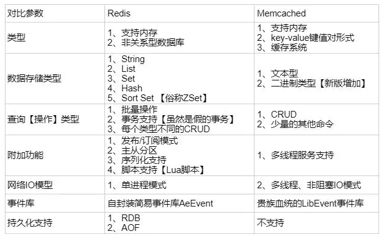

## 什么是Redis？

Redis 是一个使用 C 语言写成的，开源的 key-value 数据库,和Memcached类似，它支持存储的value类型相对更多，包括string(字符串)、list(链表)、set(集合)、zset(sorted set --有序集合)和hash（哈希类型）。这些数据类型都支持push/pop、add/remove及取交集并集和差集及更丰富的操作，而且这些操作都是原子性的。在此基础上，redis支持各种不同方式的排序。与memcached一样，为了保证效率，数据都是缓存在内存中。区别的是redis会周期性的把更新的数据写入磁盘或者把修改操作写入追加的记录文件，并且在此基础上实现了master-slave(主从)同步。目前，Vmware在资助着redis项目的开发和维护。

## Redis与Memcached的区别与比较

1 、Redis不仅仅支持简单的k/v类型的数据，同时还提供list，set，zset，hash等数据结构的存储。memcache支持简单的数据类型，String。

2 、Redis支持数据的备份，即master-slave模式的数据备份。

3 、Redis支持数据的持久化，可以将内存中的数据保持在磁盘中，重启的时候可以再次加载进行使用,而Memecache把数据全部存在内存之中

4、 redis的速度比memcached快很多

5、Memcached是多线程，非阻塞IO复用的网络模型；Redis使用单线程的IO复用模型。

## Redis与Memcached的选择

**终极策略：** 使用Redis的String类型做的事，都可以用Memcached替换，以此换取更好的性能提升； 除此以外，优先考虑Redis；

### 使用redis有哪些好处？

(1) **速度快**，因为数据存在内存中，类似于HashMap，HashMap的优势就是查找和操作的时间复杂度都是O(1)

(2)**支持丰富数据类型**，支持string，list，set，sorted set，hash

(3) **支持事务** ：redis对事务是部分支持的，如果是在入队时报错，那么都不会执行；在非入队时报错，那么成功的就会成功执行。

## MySQL里有2000w数据，Redis中只存20w的数据，如何保证Redis中的数据都是热点数据（redis有哪些数据淘汰策略？？？）

相关知识：redis 内存数据集大小上升到一定大小的时候，就会施行数据淘汰策略（回收策略）。redis 提供 6种数据淘汰策略：

1. **volatile-lru**：从已设置过期时间的数据集（server.db[i].expires）中挑选最近最少使用的数据淘汰
2. **volatile-ttl**：从已设置过期时间的数据集（server.db[i].expires）中挑选将要过期的数据淘汰
3. **volatile-random**：从已设置过期时间的数据集（server.db[i].expires）中任意选择数据淘汰
4. **allkeys-lru**：从数据集（server.db[i].dict）中挑选最近最少使用的数据淘汰
5. **allkeys-random**：从数据集（server.db[i].dict）中任意选择数据淘汰
6. **no-enviction**（驱逐）：禁止驱逐数据

## **Redis有哪些数据结构？**

字符串String、字典Hash、列表List、集合Set、有序集合SortedSet。

如果你是Redis中高级用户，还需要加上下面几种数据结构HyperLogLog、Geo、Pub/Sub。

如果你说还玩过Redis Module，像BloomFilter，RedisSearch，Redis-ML，面试官得眼睛就开始发亮了。

## **假如Redis里面有1亿个key，其中有10w个key是以某个固定的已知的前缀开头的，如果将它们全部找出来？**

使用keys指令可以扫出指定模式的key列表。

对方接着追问：如果这个redis正在给线上的业务提供服务，那使用keys指令会有什么问题？

这个时候你要回答redis关键的一个特性：redis的单线程的。keys指令会导致线程阻塞一段时间，线上服务会停顿，直到指令执行完毕，服务才能恢复。这个时候可以使用scan指令，scan指令可以无阻塞的提取出指定模式的key列表，但是会有一定的重复概率，在客户端做一次去重就可以了，但是整体所花费的时间会比直接用keys指令长。

## **使用过Redis做异步队列么，你是怎么用的？**

电商场景,不建议!

## **如果有大量的key需要设置同一时间过期，一般需要注意什么？**

如果大量的key过期时间设置的过于集中，到过期的那个时间点，redis可能会出现短暂的卡顿现象。一般需要在时间上加一个随机值，使得过期时间分散一些。

## **Redis如何做持久化的？**

bgsave做镜像全量持久化，aof做增量持久化。因为bgsave会耗费较长时间，不够实时，在停机的时候会导致大量丢失数据，所以需要aof来配合使用。在redis实例重启时，会使用bgsave持久化文件重新构建内存，再使用aof重放近期的操作指令来实现完整恢复重启之前的状态。

对方追问那如果突然机器掉电会怎样？取决于aof日志sync属性的配置，如果不要求性能，在每条写指令时都sync一下磁盘，就不会丢失数据。但是在高性能的要求下每次都sync是不现实的，一般都使用定时sync，比如1s1次，这个时候最多就会丢失1s的数据。

对方追问bgsave的原理是什么？你给出两个词汇就可以了，fork和cow。fork是指redis通过创建子进程来进行bgsave操作，cow指的是copy on write，子进程创建后，父子进程共享数据段，父进程继续提供读写服务，写脏的页面数据会逐渐和子进程分离开来。

## **Pipeline有什么好处，为什么要用pipeline？**

可以将多次IO往返的时间缩减为一次，前提是pipeline执行的指令之间没有因果相关性。使用redis-benchmark进行压测的时候可以发现影响redis的QPS峰值的一个重要因素是pipeline批次指令的数目。

## **Redis的同步机制了解么？**

Redis可以使用主从同步，从从同步。第一次同步时，主节点做一次bgsave，并同时将后续修改操作记录到内存buffer，待完成后将rdb文件全量同步到复制节点，复制节点接受完成后将rdb镜像加载到内存。加载完成后，再通知主节点将期间修改的操作记录同步到复制节点进行重放就完成了同步过程。

## **是否使用过Redis集群，集群的原理是什么？**

Redis Sentinal着眼于高可用，在master宕机时会自动将slave提升为master，继续提供服务。

Redis Cluster着眼于扩展性，在单个redis内存不足时，使用Cluster进行分片存储。

## 参考

https://juejin.im/post/5ad6e4066fb9a028d82c4b66

https://zhuanlan.zhihu.com/p/32540678

https://blog.csdn.net/u010416101/article/details/79690404

https://www.cnblogs.com/Java3y/p/10266306.html

