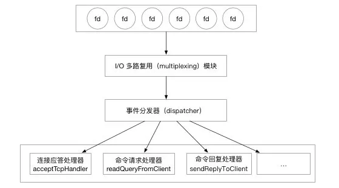
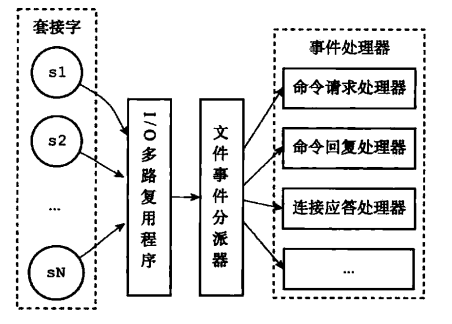
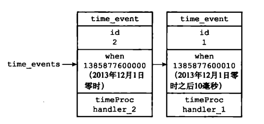

# redis事件

redis服务器是事件驱动的

- 文本事件（file event） 

  Redis服务器通过套接字与客户端（或者其他Redis服务器）
  进行连接，而文件事件就是服务器对套接字操作的抽象。服务器与客户端（或者其
  他服务器）的通信会产生相应的文件事件，而服务器则通过监听并处理这些事件来
  完成一系列网络通信操作。

- 时间事件（time event)

  Redis服务器中的一些操作（比如serverCron函数）需
  要在给定的时间点执行，而时间事件就是服务器对这类定时操作的抽象。


## 文本事件

Redis 服务器通过 socket 实现与客户端（或其他redis服务器）的交互,文件事件就是服务器对 socket 操作的抽象。 Redis 服务器，通过监听这些 socket 产生的文件事件并处理这些事件，实现对客户端调用的响应。

### Reactor模型






这两个图说的是一样的，socket套接字连接，在linux 中实际就是一种文件。

“I/O 多路复用模块”会监听多个 FD ，当这些FD产生，accept，read，write 或 close 的文件事件。会向“文件事件分发器（dispatcher）”传送事件。

文件事件分发器（dispatcher）在收到事件之后，会根据事件的类型将事件分发给对应的 handler。


**I/O 多路复用模块**

Redis 的 I/O 多路复用模块，其实是封装了操作系统提供的 select，epoll，avport 和 kqueue 这些基础函数。向上层提供了一个统一的接口，屏蔽了底层实现的细节。

epoll

```c
/*
 * 创建一个epoll的句柄，size用来告诉内核这个监听的数目一共有多大
 */
int epoll_create(int size)；

/*
 * 可以理解为，增删改 fd 需要监听的事件
 * epfd 是 epoll_create() 创建的句柄。
 * op 表示 增删改
 * epoll_event 表示需要监听的事件，Redis 只用到了可读，可写，错误，挂断 四个状态
 */
int epoll_ctl(int epfd, int op, int fd, struct epoll_event *event)；

/*
 * 可以理解为查询符合条件的事件
 * epfd 是 epoll_create() 创建的句柄。
 * epoll_event 用来存放从内核得到事件的集合
 * maxevents 获取的最大时间数
 * timeout 等待超时时间
 */
int epoll_wait(int epfd, struct epoll_event * events, int maxevents, int timeout);

```


# 时间事件

### 介绍

Redis 有很多操作需要在给定的时间点进行处理，时间事件就是对这类定时任务的抽象。

时间事件结构

```c
/* Time event structure
 *
 * 时间事件结构
 */
typedef struct aeTimeEvent {

    // 时间事件的唯一标识符
    long long id; /* time event identifier. */

    // 事件的到达时间
    long when_sec; /* seconds */
    long when_ms; /* milliseconds */

    // 事件处理函数
    aeTimeProc *timeProc;

    // 事件释放函数
    aeEventFinalizerProc *finalizerProc;

    // 多路复用库的私有数据
    void *clientData;

    // 指向下个时间事件结构，形成链表
    struct aeTimeEvent *next;

} aeTimeEvent;

```


### 定时和周期

一个时间事件是定时事件还是周期性事件取决于时间事件处理器的返回值。

- 如果事件处理器返回ae.h/AE_NOMORE，那么这个事件为定时事件：该事件在达
  到一次之后就会被删除，之后不再到达。
- 如果事件处理器返回一个非AE_NOMORE的整数值，那么这个事件为周期性事件，当一个时间事件到达之后，服务器会根据事件处理器返回的值，对时间事件的when属性进行更新，让这个事件在一段时间之后再次到达，并以这种方式一直更新并运行下去。比如说，如果一个时间事件的处理器返回整数值30，那么服务器应该对这个时间事件进行更新，让这个事件在30毫秒之后再次到达。


### 时间事件实例：serverCron函数

持续运行的Redis服务器需要定期对自身的资源和状态进行检查和调整，从而确保服务器可以长期、稳定地运行，这些定期操作由redis.c/serverCron函数负责执行，它的主要工作包括：

- 更新服务器的各类统计信息，比如时间、内存占用、数据库占用情况等。
- 清理数据库中的过期键值对。
- 关闭和清理连接失效的客户端。
- 尝试进行AOF或RDB持久化操作。
- 如果服务器是主服务器，那么对从服务器进行定期同步。
- 如果处于集群模式，对集群进行定期同步和连接测试。
  
  Redis服务器以周期性事件的方式来运行servercron函数，在服务器运行期间，每
  隔一段时间，servercron就会执行一次，直到服务器关闭为止。


### 事件调度processTimeEvent

ae.c/processTimeEvent函数是时间事件的执行器，这个函数会遍历所有已到达的时间事件，
并调用这些事件的处理器。已到达指的是，时间事件的when属性记录的UNIX戳小于等于当前事件戳。




Redis 使用这个函数处理所有的时间事件，我们整理一下执行思路：

1. 记录最新一次执行这个函数的时间，用于处理系统时间被修改产生的问题。
2. 遍历链表找出所有 when_sec 和 when_ms 小于现在时间的事件。
3. 执行事件对应的处理函数。
4. 检查事件类型，如果是周期事件则刷新该事件下一次的执行事件。
5. 否则从列表中删除事件。