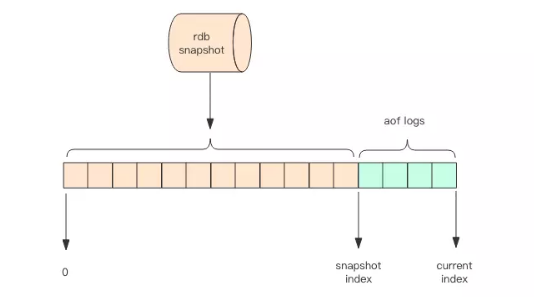

#  AOF持久化

> 保存了重建数据库状态的所有写命令


## 实现

先执行指令才将日志存盘。这点不同于leveldb、hbase等存储引擎，它们都是先存储日志再做逻辑处理。

### 命令追加

当 AOF 持久化功能处于打开状态时， 服务器在执行完一个写命令之后， 会以协议格式将被执行的写命令追加到服务器状态的 `aof_buf` 缓冲区的末尾。


### 写入缓冲区与同步

Redis 的服务器进程就是一个事件循环（loop）， 这个循环中的文件事件负责接收客户端的命令请求， 以及向客户端发送命令回复， 而时间事件则负责执行像 `serverCron` 函数这样需要定时运行的函数。

因为服务器在处理文件事件时可能会执行写命令， 使得一些内容被追加到 `aof_buf` 缓冲区里面， 所以在服务器每次结束一个事件循环之前， 它都会调用 `flushAppendOnlyFile` 函数， 考虑是否需要将 `aof_buf` 缓冲区中的内容写入和保存到 AOF 文件里面， 这个过程可以用以下伪代码表示：

```python
def eventLoop():

    while True:

        # 处理文件事件，接收命令请求以及发送命令回复
        # 处理命令请求时可能会有新内容被追加到 aof_buf 缓冲区中
        processFileEvents()

        # 处理时间事件
        processTimeEvents()

        # 考虑是否要将 aof_buf 中的内容写入和保存到 AOF 文件里面
        flushAppendOnlyFile()
```

`flushAppendOnlyFile` 函数的行为由服务器配置的 `appendfsync` 选项的值来决定， 各个不同值产生的行为如表 TABLE_APPENDFSYNC 所示。

| `appendfsync` 选项的值 | `flushAppendOnlyFile` 函数的行为                             |
| :--------------------- | :----------------------------------------------------------- |
| `always`               | 将 `aof_buf` 缓冲区中的所有内容写入并同步到 AOF 文件。       |
| `everysec`             | 将 `aof_buf` 缓冲区中的所有内容写入到 AOF 文件， 如果上次同步 AOF 文件的时间距离现在超过一秒钟， 那么再次对 AOF 文件进行同步， 并且这个同步操作是由一个线程专门负责执行的。 |
| `no`                   | 将 `aof_buf` 缓冲区中的所有内容写入到 AOF 文件， 但并不对 AOF 文件进行同步， 何时同步由操作系统来决定。 |


文件的写入和同步--操作系统底层实现

为了提高文件的写入效率， 在现代操作系统中， 当用户调用 `write` 函数， 将一些数据写入到文件的时候， 操作系统通常会将写入数据暂时保存在一个内存缓冲区里面， 等到缓冲区的空间被填满、或者超过了指定的时限之后， 才真正地将缓冲区中的数据写入到磁盘里面。

这种做法虽然提高了效率， 但也为写入数据带来了安全问题， 因为如果计算机发生停机， 那么保存在内存缓冲区里面的写入数据将会丢失。

为此， 系统提供了 `fsync` 和 `fdatasync` 两个同步函数， 它们可以强制让操作系统立即将缓冲区中的数据写入到硬盘里面， 从而确保写入数据的安全性。


## AOF重写

###　动机

Redis 在长期运行的过程中，AOF 的日志会越变越长。如果实例宕机重启，重放整个 AOF 日志会非常耗时，导致长时间 Redis 无法对外提供服务。所以需要对 AOF 日志瘦身


### 命令

 bgrewriteaof 

### 实现

重新从数据库生成所有写命令.这样可以生成最简内容。

AOF采用后台子进程进行，保证父进程不阻塞。


### 状态不一致问题

子进程AOF异步重写，父进程继续执行命令请求导致的不一致问题：

**AOF重写缓冲区**


服务器同时将命令发送给AOF文件和AOF重写缓冲区。

这样父进程继续执行的所有写命令也会被记录。


### 重写完成

当子进程完成AOF重写工作之后，它会向父进程发送一个信号，父进程在接到该信号
之后，会调用一个信号处理函数，并执行以下工作：
1）将AOF重写缓冲区中的所有内容写人到新AOF文件中，这时新AOF文件所保存的
数据库状态将和服务器当前的数据库状态一致。
2）对新的AOF文件进行改名，原子地（atomic）覆盖现有的AOF文件，完成新旧两
个AOF文件的替换
这个信号处理函数执行完毕之后，父进程就可以继续像往常一样接受命令请求了。

**只有在执行这个信号处理函数的时候父进程是阻塞的.**


## 从节点执行

所以通常 Redis 的主节点是不会进行持久化操作，持久化操作主要在从节点进行。从节点是备份节点，没有来自客户端请求的压力，它的操作系统资源往往比较充沛。


但是如果出现网络分区，从节点长期连不上主节点，就会出现数据不一致的问题，特别是在网络分区出现的情况下又不小心主节点宕机了，那么数据就会丢失，所以在生产环境要做好实时监控工作，保证网络畅通或者能快速修复。另外还应该再增加一个从节点以降低网络分区的概率，只要有一个从节点数据同步正常，数据也就不会轻易丢失。


## 混合持久化

重启 Redis 时，我们很少使用 rdb 来恢复内存状态，因为会丢失大量数据。我们通常使用 AOF 日志重放，但是重放 AOF 日志性能相对 rdb 来说要慢很多，这样在 Redis 实例很大的情况下，启动需要花费很长的时间。

Redis 4.0 为了解决这个问题，带来了一个新的持久化选项——混合持久化。将 rdb 文件的内容和增量的 AOF 日志文件存在一起。这里的 AOF 日志不再是全量的日志，而是自持久化开始到持久化结束的这段时间发生的增量 AOF 日志，通常这部分 AOF 日志很小。




## 问题 -- 为什么 Redis 先执行指令再记录aof日志而不是像其它存储引擎一样反过来呢？

### 数据丢失情况

在常见的数据库中，持久化重做日志一般是先写日志再修改数据库，即使突然宕机，也可以保证数据/操作不会丢失。

redis是基于内存的，快照备份不会实时进行，一般是aof，aof也不是每个命令都执行，假设配置1s写一次aof，一旦宕机会丢失1s的数据，这无法避免，就是会丢数据，即使先写日志也一样。


### 在数据会丢失的情况下考虑先执行命令

redis也采取先写日志再操作的话，如果命令执行失败，AOF日志中会出现很多无效/错误的命令记录，对本来就庞大的AOF文件来说简直是雪上加霜。先执行命令的话，可以减轻aof的压力。


### 事务

传统数据库是多个线程处理数据，要保证并发下以及对应事务隔离下的数据可见性，所以采取的是日志先行的策略。通过日志才能达到事务回滚的目的。


redis的事务比起mysql等数据库的事务机制来说，可以称为弱事务，事务中出现某一个错误也会继续执行，也没有回滚。这样的事务，会出现很多没有修改成功数据命令。如果先写日志，会有很多无效命令。


