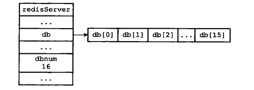
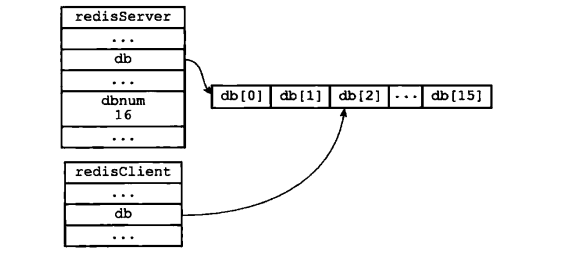
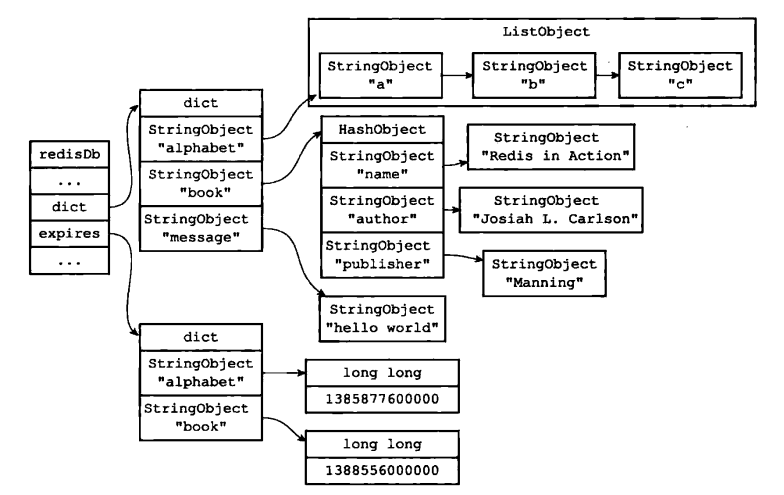

## 介绍

redis单机不只一个数据库，可以有多个，数据隔离。


Redis服务器将所有数据库都保存在服务器状态redis.h/redisserver结构的db数组中，db数组的每个项都是一个redis.h/redisDb结构，每个rediSDb结构代表一个数据库：

```c
struct redisServer{
//一个数组，保存着服务器中的所有数据库
redisDb *db;
// 服务器数据库数量  默认16个
int dbnum;
}
```




## 切换数据库

在服务器内部，客户端状态redisC1ient结构的db属性记录了客户端当前的目标数据库，这个属性是一个指向rediSDb结构的指针。

在客户端使用SELECT  命令可以切换数据库




## 数据库键




## 过期策略

redis 会将每个设置了过期时间的 key 放入到一个独立的字典中，也就是上面提到的expire字典，以后会定时遍历这个字典来删除到期的 key。除了定时遍历之外，它还会使用惰性策略来删除过期的 key，所谓惰性策略就是在客户端访问这个 key 的时候，redis 对 key 的过期时间进行检查，如果过期了就立即删除。定时删除是集中处理，惰性删除是零散处理。


### 定时扫描策略

Redis 默认会每秒进行十次过期扫描，过期扫描不会遍历过期字典中所有的 key，而是采用了一种简单的贪心策略。

1. 从过期字典中随机 20 个 key；

2. 删除这 20 个 key 中已经过期的 key；

3. 如果过期的 key 比率超过 1/4，那就重复步骤 1；

同时，为了保证过期扫描不会出现循环过度，导致线程卡死现象，算法还增加了扫描时间的上限，默认不会超过 25ms。

   

## 从库的过期策略

从库不会进行过期扫描，从库对过期的处理是被动的。主库在 key 到期时，会在 AOF 文件里增加一条 `del` 指令，同步到所有的从库，从库通过执行这条 `del` 指令来删除过期的 key。

因为指令同步是异步进行的，所以主库过期的 key 的 `del` 指令没有及时同步到从库的话，会出现主从数据的不一致，主库没有的数据在从库里还存在，比如上一节的集群环境分布式锁的算法漏洞就是因为这个同步延迟产生的。

