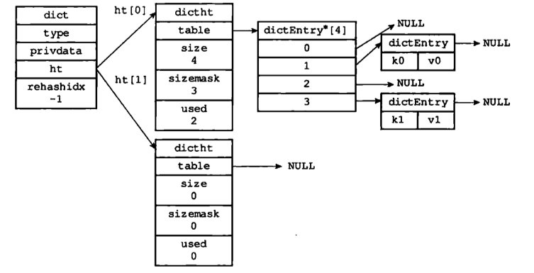
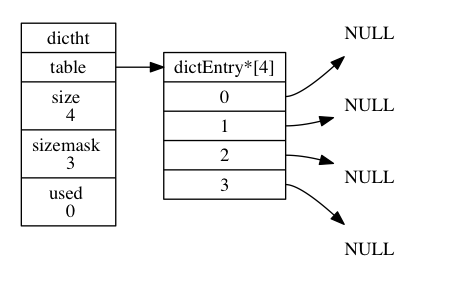

## 概览



## dict结构

Redis 中的字典由 `dict.h/dict` 结构表示

```c
typedef struct dict {

    // 类型特定函数
    dictType *type;

    // 私有数据
    void *privdata;

    // 哈希表
    dictht ht[2];

    // rehash 索引
    // 当 rehash 不在进行时，值为 -1
    int rehashidx; /* rehashing not in progress if rehashidx == -1 */

} dict;
```

`type` 属性和 `privdata` 属性是针对不同类型的键值对， 为创建多态字典而设置的

- `type` 属性是一个指向 `dictType` 结构的指针， 每个 `dictType` 结构保存了一簇用于操作特定类型键值对的函数， Redis 会为用途不同的字典设置不同的类型特定函数。

  ```c
  typedef struct dictType {
  
      // 计算哈希值的函数
      unsigned int (*hashFunction)(const void *key);
  
      // 复制键的函数
      void *(*keyDup)(void *privdata, const void *key);
  
      // 复制值的函数
      void *(*valDup)(void *privdata, const void *obj);
  
      // 对比键的函数
      int (*keyCompare)(void *privdata, const void *key1, const void *key2);
  
      // 销毁键的函数
      void (*keyDestructor)(void *privdata, void *key);
  
      // 销毁值的函数
      void (*valDestructor)(void *privdata, void *obj);
  
  } dictType;
  ```

  

- 私有数据指针`privdata` 属性则保存了需要传给那些类型特定函数的可选参数，由调用者在创建dict的时候传进来。

  

`ht` 属性是一个包含两个项的数组， 数组中的每个项都是一个 `dictht` 哈希表， 一般情况下， 字典只使用 `ht[0]` 哈希表， `ht[1]` 哈希表只会在对 `ht[0]` 哈希表进行 rehash 时使用。

除了 `ht[1]` 之外， 另一个和 rehash 有关的属性就是 `rehashidx` ： 它记录了 rehash 目前的进度， 如果目前没有在进行 rehash ， 那么它的值为 `-1` 。

**普通状态字典**


哈希表`dictht`



```c
typedef struct dictht {

    // 哈希表数组
    dictEntry **table;

    // 哈希表大小
    unsigned long size;

    // 哈希表大小掩码，用于计算索引值
    // 总是等于 size - 1
    unsigned long sizemask;

    // 该哈希表已有节点的数量
    unsigned long used;

} dictht;
```


哈希表节点`dictEntry` 

```c
typedef struct dictEntry {

    // 键
    void *key;

    // 值
    union {
        void *val;
        uint64_t u64;
        int64_t s64;
    } v;

    // 指向下个哈希表节点，形成链表
    struct dictEntry *next;

} dictEntry;
```

## 原理

和java中Hashmap很像,数组加链表,使用链地址法解决冲突.

index= h & n-1.


## 使用的hash算法  Murnurhash2

MurmurHash 算法最初由 Austin Appleby 于 2008 年发明， 这种算法的优点在于， 即使输入的键是有规律的， 算法仍能给出一个很好的随机分布性， 并且算法的计算速度也非常快。

MurmurHash 算法目前的最新版本为 MurmurHash3 ， 而 Redis 使用的是 MurmurHash2 ， 关于 MurmurHash 算法的更多信息可以参考该算法的主页： http://code.google.com/p/smhasher/ 。

## rehash

1.给h[1]分配内存

2.元素迁移到h[1]

3.h[0]指向h[1],释放h[1]=null.

详细具体过程参考

http://redisbook.com/preview/dict/rehashing.html

**渐进式hash**

1) 为 ht [1] 分配空间，让字典同时持有 ht [0] 和 ht [1] 两个哈希表

2) 在字典中维持一个索引计数器变量 **rehashidx，并将它的值设置为 0**, 表示 rehash 工作正式开始。

3) 在 rehash 进行期间，每次对字典执行添加、删除、查找或者更新操作时，**程序除了执行指定的操作以外，还会顺带将 ht [0]哈希表在 rehashidx 索引上的所有键值对 rehash 到 ht [1]**，当 rehash 工作完成之后，程序将 rehashidx 属性的值增1。**rehashidx在渐进式hash过程中的取值范围是0-size-1**.

4) 随着字典操作的不断执行，最终在某个时间点上，ht [0] 的所有健值对都会被 rehash 至 ht [1]，这时程序将 rehashidx 属性的值设为-1, 表示 rehash 操作已完成。

渐进式 rehash 的好处在于它采取分而治之的方式，将 rehash 键值对所需的计算工作均推到对字典的每个添加、删除、查找和更新操作上，从而避免了集中式 rehash 而带来的庞大计算量。


在进行渐进式 rehash 的过程中， 字典会同时使用 `ht[0]` 和 `ht[1]` 两个哈希表， 所以在渐进式 rehash 进行期间， 字典的删除（delete）、查找（find）、更新（update）等操作会在两个哈希表上进行： 比如说， 要在字典里面查找一个键的话， 程序会先在 `ht[0]`里面进行查找， 如果没找到的话， 就会继续到 `ht[1]` 里面进行查找， 诸如此类。

另外， 在渐进式 rehash 执行期间， 新添加到字典的键值对一律会被保存到 `ht[1]` 里面， 而 `ht[0]` 则不再进行任何添加操作： 这一措施保证了 `ht[0]` 包含的键值对数量会只减不增， 并随着 rehash 操作的执行而最终变成空表。