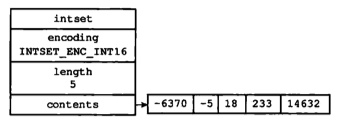

## 场景

整数集合（intset）是集合键的底层实现之一，**当一个集合只包含整数值元素**，**并且这个集合的元素数量不多**时，Redis就会使用整数集合作为集合健的底层实现。

举个例子，如果我们创建一个只包含五个元素的集合键，并且集合中的所有元素都是整数值，那么这个集合键的底层实现就会是整数集合

```shell
redis> SADD numbers 1 3 5 7 9  
(integer) 5
redis> OBJECT ENCODING numbers 
"inset"
```

**不包含重复项**

## 结构

```c
typedef struct intset {
    // 编码方式
    uint32_t encoding;
    // 元素个数
    uint32_t length;
    // 保存元素的数组
    int8_t contents[];
} intset;
```

虽然声明为int8_t类型的数组,但是不保存任何int8_t类型的数据,真正的类型取决于encoding

**encoding**

- INTSET_ENC_INT16
- INTSET_ENC_INT32
- INTSET_ENC_INT64




## 升级

INTSET_ENC_INT16的整数集合中插入一个INTSET_ENC_INT64的数据

## 降级

不支持