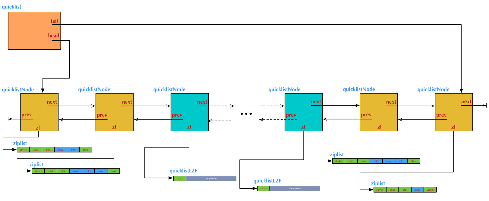

## 介绍

quicklist是一个双向链表，每个节点都是一个ziplist。

quicklist的结构为什么这样设计呢？总结起来，大概又是一个空间和时间的折中：

- 双向链表便于在表的两端进行push和pop操作，但是它的内存开销比较大。首先，它在每个节点上除了要保存数据之外，还要额外保存两个指针；其次，双向链表的各个节点是单独的内存块，地址不连续，节点多了容易产生内存碎片。
- ziplist由于是一整块连续内存，所以存储效率很高。但是，它不利于修改操作，每次数据变动都会引发一次内存的realloc。特别是当ziplist长度很长的时候，一次realloc可能会导致大批量的数据拷贝，进一步降低性能。

于是，结合了双向链表和ziplist的优点，quicklist就应运而生了。

## 相关配置

list-max-ziplist-size -2

当取正值的时候，表示按照数据项个数来限定每个quicklist节点上的ziplist长度。比如，当这个参数配置成5的时候，表示每个quicklist节点的ziplist最多包含5个数据项。

当取负值的时候，表示按照占用字节数来限定每个quicklist节点上的ziplist长度。这时，它只能取-1到-5这五个值，每个值含义如下：

- -5: 每个quicklist节点上的ziplist大小不能超过64 Kb。（注：1kb => 1024 bytes）
- -4: 每个quicklist节点上的ziplist大小不能超过32 Kb。
- -3: 每个quicklist节点上的ziplist大小不能超过16 Kb。
- -2: 每个quicklist节点上的ziplist大小不能超过8 Kb。（-2是Redis给出的默认值）
- -1: 每个quicklist节点上的ziplist大小不能超过4 Kb。

list-compress-depth 0

表示一个quicklist两端不被压缩的节点个数。注：这里的节点个数是指quicklist双向链表的节点个数，而不是指ziplist里面的数据项个数。实际上，一个quicklist节点上的ziplist，如果被压缩，就是整体被压缩的。

Redis对于quicklist内部节点的压缩算法，采用的[LZF](https://link.juejin.im/?target=http%3A%2F%2Foldhome.schmorp.de%2Fmarc%2Fliblzf.html)——一种无损压缩算法。

0: 是个特殊值，表示都不压缩。这是Redis的默认值。

1: 表示quicklist两端各有1个节点不压缩，中间的节点压缩。

2: 表示quicklist两端各有2个节点不压缩，中间的节点压缩。

3: 表示quicklist两端各有3个节点不压缩，中间的节点压缩。

依此类推...

## 参考

https://juejin.im/post/579222427db2a20054d8f884