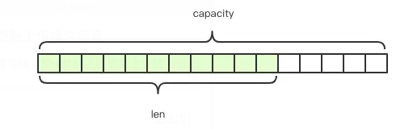

##　简单动态字符串SDS

### simple dynamic string

3.2之前

```c
typedef char *sds;      //注意，sds其实不是一个结构体类型，而是被typedef的char*，好处见下文

struct sdshdr {
    unsigned int len;   //buf中已经使用的长度
    unsigned int free;  //buf中未使用的长度
    char buf[];         //柔性数组buf
};

```


3.2和之后

`Redis 3.2 版本`中，对数据结构做出了修改，针对不同的长度范围定义了不同的结构

```c
typedef char *sds;      

struct __attribute__ ((__packed__)) sdshdr5 {     // 对应的字符串长度小于 1<<5
    unsigned char flags; /* 3 lsb of type, and 5 msb of string length */
    char buf[];
};
struct __attribute__ ((__packed__)) sdshdr8 {     // 对应的字符串长度小于 1<<8
    uint8_t len; /* used */                       //目前字符创的长度
    uint8_t alloc;                                        //最大容量
    unsigned char flags;                          //flag用3bit来标明类型，类型后续解释，其余5bit目前没有使用
    char buf[];                                              //柔性数组，以'\0'结尾
};
......
struct __attribute__ ((__packed__)) sdshdr64 {    // 对应的字符串长度小于 1<<64
    uint64_t len; /* used */
    uint64_t alloc; /* excluding the header and null terminator */
    unsigned char flags; /* 3 lsb of type, 5 unused bits */
    char buf[];
};
```
新版带来的好处就是针对长度不同的字符串做了优化，选取不同的数据类型uint8_t或者uint16_t或者uint32_t等来表示长度、一共申请字节的大小等。上面结构体中的__attribute__ ((__packed__)) 设置是告诉编译器取消字节对齐，则结构体的大小就是按照结构体成员实际大小相加得到的。



Redis 规定字符串的长度不得超过 512M 字节。创建字符串时 `len` 和 `capacity` 一样长，不会多分配冗余空间，这是因为绝大多数场景下我们不会使用 `append` 操作来修改字符串。


### 与C字符串区别

常数复杂度获取len

杜绝缓冲区溢出		

二进制安全，允许\0

空间预分配和惰性释放，减少内存操作。	


### 扩容策略

字符串在长度小于 1M 之前，扩容空间采用加倍策略，也就是保留 100% 的冗余空间。当长度超过 1M 之后，为了避免加倍后的冗余空间过大而导致浪费，每次扩容只会多分配 1M 大小的冗余空间。