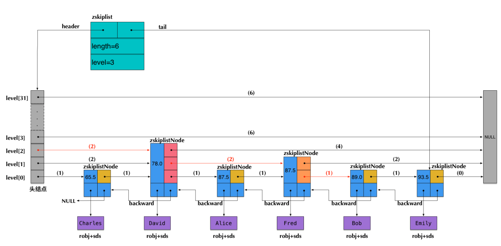
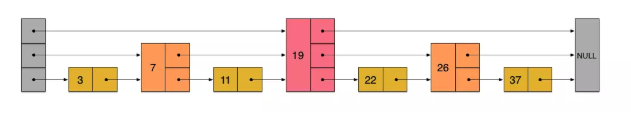
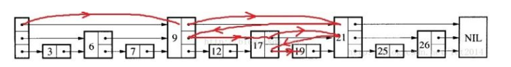
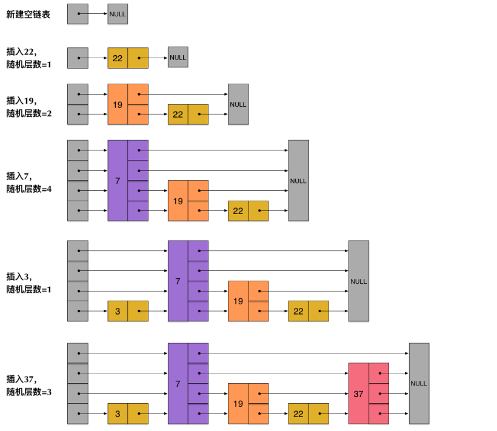

## 概览




## 跳跃表



按照上面生成链表的方式，上面每一层链表的节点个数，是下面一层的节点个数的一半，这样查找过程就非常类似于一个二分查找，使得查找的时间复杂度可以降低到O(log n)。

**查找过程**



```c++
template<typename K, typename V>
Node<K, V> *SkipList<K, V>::search(const K key) const {
    Node<K, V> *node = header;
    for (int i = level; i >= 0; --i) {
        while ((node->forward[i])->key < key) {
            node = *(node->forward + i);
        }
    }
    node = node->forward[0];
    if (node->key == key) {
        return node;
    } else {
        return nullptr;
    }
};
```


## skiplist插入过程

跳跃表在插入数据的时候有很大的问题。新插入一个节点之后，就会打乱上下相邻两层链表上节点个数严格的2:1的对应关系。如果要维持这种对应关系，就必须把新插入的节点后面的所有节点（也包括新插入的节点）重新进行调整，这会让时间复杂度重新蜕化成O(n)。删除数据也有同样的问题.

skiplist为了避免这一问题，它不要求上下相邻两层链表之间的节点个数有严格的对应关系，而是为每个节点随机出一个层数(level)。比如，一个节点随机出的层数是3，那么就把它链入到第1层到第3层这三层链表中.




## 与平衡树（AVL树和红黑树）的对比


**插入删除效率**

AVL树有着严格的O(logN)的查询效率，但是由于插入过程中可能需要多次旋转，导致插入效率较低，因而才有了在工程界更加实用的红黑树。

平衡树的插入和删除操作可能引发子树的调整，逻辑复杂，而skiplist的插入和删除只需要修改相邻节点的指针，操作简单又快速。


**范围查找**

在做范围查找的时候，平衡树（如AVL、红黑树等）比skiplist操作要复杂。在平衡树上，我们找到指定范围的小值之后，还需要以中序遍历的顺序继续寻找其它不超过大值的节点。如果不对平衡树进行一定的改造，这里的中序遍历并不容易实现。而在skiplist上进行范围查找就非常简单，只需要在找到小值之后，对第1层链表进行若干步的遍历就可以实现。


**实现难度**

skiplist要容易得多


**内存占用**


## 参考

https://zhuanlan.zhihu.com/p/33674267

https://juejin.im/post/57fa935b0e3dd90057c50fbc