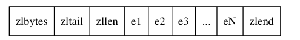

## 场景

压缩列表(ziplist)是列表键和哈希键的底层实现之ー。当一个列表键只包含**少量列表项,并且每个列表项要么就是小整数值，要么就是长度比较短的字符串**，那么 Redis 就会使用压缩列表来做列表键的底层实现.

```shell
redis> RPUSH lst 1 3 5 10086 "hello" "world"  #小整数/小字符串.
(integer)6
k
redis> OBJECT ENCODING lst
"ziplist"
```

另外,当一个哈希健只包含少量键值对，比且每个键值对的键和值要么就是小整数值要么就是长度比较短的字符串,那么 Redis 就会使用压缩列表来做哈希键的底层实现。

```shell
redis>HMSET profile "name" "jack" "age" 28
ok
redis>OBJECT ENCODING profile
"ziplist"/quicklist
```

## 结构

ziplist充分体现了Redis对于存储效率的追求。一个普通的双向链表，链表中每一项都占用独立的一块内存，各项之间用地址指针（或引用）连接起来。这种方式会带来大量的内存碎片，而且地址指针也会占用额外的内存。而ziplist却是将表中每一项存放在前后连续的地址空间内，一个ziplist整体占用一大块内存。它是一个表（list），但其实不是一个链表（linked list）

从宏观上看，ziplist的内存结构如下：




比如：


- 0x50(80)代表总长度80
- 0x3c (60)代表为尾节点的位置是p+60
- zllen=0x3代表 元素数目是3

**结构体**

```c
struct ziplist<T> {修改相邻节点的指针，操作简单又快速。
    int32 zlbytes; // 整个压缩列表占用字节数
    int32 zltail_offset; // 最后一个元素距离压缩列表起始位置的偏移量，用于快速定位到最后一个节点
    int16 zllength; // 元素个数
    T[] entries; // 元素内容列表，挨个挨个紧凑存储
    int8 zlend; // 标志压缩列表的结束，值恒为 0xFF 255
}
```


压缩列表为了支持双向遍历，所以才会有 `ztail_offset` 这个字段，用来快速定位到最后一个元素，然后倒着遍历。


## entry节点

entry 块随着容纳的元素类型不同，也会有不一样的结构。

```c
struct entry {
    int<var> prevlen; // 前一个 entry 的字节长度
    int<var> encoding; // 元素类型编码
    optional byte[] content; // 元素内容
}
```

每个压缩列表节点可以保存一个字节数组或者一个整数值，其中，字节数组可以是以下
三种长度的其中一种：

- 长度小于等于63(2^6-1)字节的字节数组；

- 长度小于等于16383(2^14一1)字节的字节数组；

- 长度小于等于4294967295（2^32一1）字节的字节数组；

而整数值则可以是以下六种长度的其中一种：

- 4位长，介于0至12之间的无符号整数，
- 1字节长的有符号整数；
- 3字节长的有符号整数；
- int16_t类型整数
- int32_t类型整数；
- int64_t类型整数。

###  prevlen

节点的`previous_entry_length`属性以字节为单位，记录了压缩列表中前一个节点的长度。previous_entry_length属性的长度可以是1字节或者5字节：

- 如果前一节点的长度小于254字节，那么previous_entry_length属性的长度为1字节：前一节点的长度就保存在这一个字节里面。
- 如果前一节点的长度大于等于254字节，那么previous_entry_length属性的长度为5字节：其中属性的第一字节会被设置为OXFE（十进制值254），而之后的四个字节则用于保存前一节点的长度。

可以通过p-previous_entry_length 得到前一个节点的起始位置。

支持从尾向头遍历


### encoding

1-5字节，表示存放的是字节数组还是整数值

### content

节点的content属性负责保存节点的值，节点值可以是一个字节数组或者整数，值的类型和长度由节点的encoding属性决定。

一个保存字节数组的例子


- encoding编码的最高两位00表示节点保存的是一个字节数组
- 编码的后六位001011记录了字节数组的长度11
- content属性保存着节点的值"hello world".


一个保存整数值的例子


- encoding 11000000 表示存放的是int16_t类型的整数
- content保存了10086


## 连锁更新

前面说过，每个节点的previous_entry_length属性都记录了前一个节点的长度：

- 如果前一节点的长度小于254字节，那么previous_entry_length属性需要用
  1字节长的空间来保存这个长度值。
- 如果前一节点的长度大于等于254字节，那么previousentry_length属性需
  要用5字节长的空间来保存这个长度值。
  
  

现在，考虑这样一种情况：在一个压缩列表中，有多个连续的、长度介于250字节到253字节之间的节点e1至eN。


因为e1至eN的所有节点的长度都小于254字节，记录这些节点的长度只需要1字节长的previous_entry_length，换句话说，e1至eN的所有节点的previous_entrylength属性都是1字节长的。
这时，如果我们将一个长度大于等于254字节的新节点new设置为压缩列表的表头节点，那么new将成为e1的前置节点。


因为e1的previous_entry_length属性仅长1字节，它没办法保存新节点new的长度，所以程序将对压缩列表执行空间分配操作，并将el节点的previous_entry_length属性从原来的1字节长扩展为5字节长。

现在，麻烦的事情来了，el原本的长度介于250字节至253字节之间，在为previous_entry_length属性新增四个字节的空间之后，e1的长度就变成了介于254字节至257字节之间，而这种长度使用1字节长previous_entry_length属性是没办法保存的。因此，为了让e2的previous_entrylength属性可以记录下el的长度，程序需要再次对压缩列表执行空间重分配操作，并将e2节点的previous_entry_length属性从原来的1字节长扩展为5字节长。

为了让每个节点的previous_entry_xength属性都符合压缩列表对节点的要求，程序需要不断地对压缩列表执行空间重分配操作，直到eN为止。

连锁更新在最坏情况下需要对压缩列表执行 `N` 次空间重分配操作， 而每次空间重分配的最坏复杂度为 O(N) ， 所以连锁更新的最坏复杂度为 O(N^2).

要注意的是， 尽管连锁更新的复杂度较高， 但它真正造成性能问题的几率是很低的：

- 首先， 压缩列表里要恰好有多个连续的、长度介于 `250` 字节至 `253` 字节之间的节点， 连锁更新才有可能被引发， 在实际中， 这种情况并不多见；
- 其次， 即使出现连锁更新， 但只要被更新的节点数量不多， 就不会对性能造成任何影响： 比如说， 对三五个节点进行连锁更新是绝对不会影响性能的；

因为以上原因， `ziplistPush` 等命令的平均复杂度仅为 O(N) ， 在实际中， 我们可以放心地使用这些函数， 而不必担心连锁更新会影响压缩列表的性能。

## 总结

- 压缩列表是一种为节约内存而开发的顺序型数据结构。
- 压缩列表被用作列表键和哈希键的底层实现之一
- 压缩列表可以包含多个节点．每个节点可以保存一个字节数组或者整数值。
- 添加新节点到压缩列表，或者从压缩列表中除节点，可能会引发连锁更新操作，但这种操作出现的几率并不高。

## 相关配置

hash-max-ziplist-entries 512
hash-max-ziplist-value 64

这个配置的意思是说，在如下两个条件之一满足的时候，ziplist会转成dict：

- 当hash中的数据项（即field-value对）的数目超过512的时候，也就是ziplist数据项超过1024的时候（请参考t_hash.c中的`hashTypeSet`函数）。
- 当hash中插入的任意一个value的长度超过了64的时候（请参考t_hash.c中的`hashTypeTryConversion`函数）。


