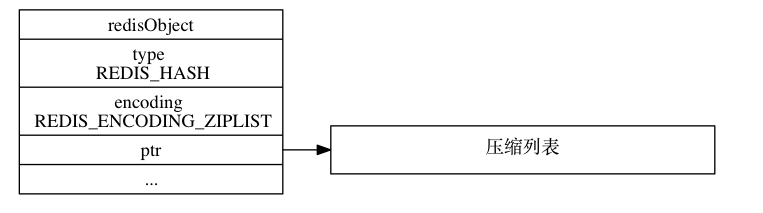
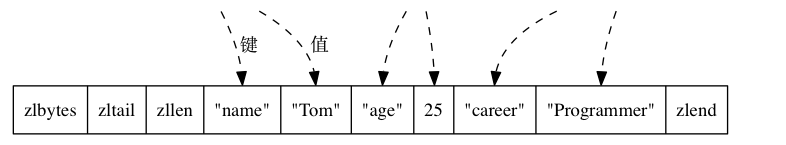
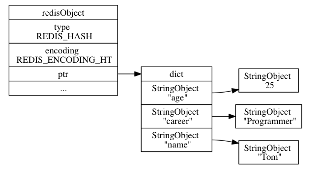

# 哈希对象


## 编码

哈希对象的编码可以是 `ziplist` 或者 `dict` 

### ziplist

`ziplist` 编码的哈希对象使用压缩列表作为底层实现， 每当有新的键值对要加入到哈希对象时， 程序会先将保存了键的压缩列表节点推入到压缩列表表尾， 然后再将保存了值的压缩列表节点推入到压缩列表表尾， 因此：

- 保存了同一键值对的两个节点总是紧挨在一起， 保存键的节点在前， 保存值的节点在后；
- 先添加到哈希对象中的键值对会被放在压缩列表的表头方向， 而后来添加到哈希对象中的键值对会被放在压缩列表的表尾方向。

```shell
redis> HSET profile name "Tom"
(integer) 1

redis> HSET profile age 25
(integer) 1

redis> HSET profile career "Programmer"
(integer) 1
```

如果 `profile` 键的值对象使用的是 `ziplist` 编码， 那么这个值对象将会是







 `hashtable` 编码的哈希对象使用字典作为底层实现， 哈希对象中的每个键值对都使用一个字典键值对来保存：

- 字典的每个键都是一个字符串对象， 对象中保存了键值对的键；
- 字典的每个值都是一个字符串对象， 对象中保存了键值对的值。


### dict

如果前面 `profile` 键创建的不是 `ziplist` 编码的哈希对象， 而是 `hashtable` 编码的哈希对象， 那么这个哈希对象应该会是





## 编码转换

当哈希对象可以同时满足以下两个条件时， 哈希对象使用 `ziplist` 编码：

1. 哈希对象保存的所有键值对的键和值的字符串长度都小于 `64` 字节；

2. 哈希对象保存的键值对数量小于 `512` 个；


这两个条件的上限值是可以修改的， 具体请看配置文件中关于 `hash-max-ziplist-value` 选项和 `hash-max-ziplist-entries`


哈希对象因为键值对的键长度太大而引起编码转换

```shell
# 哈希对象只包含一个键和值都不超过 64 个字节的键值对
redis> HSET book name "Mastering C++ in 21 days"
(integer) 1

redis> OBJECT ENCODING book
"ziplist"

# 向哈希对象添加一个新的键值对，键的长度为 66 字节
redis> HSET book long_long_long_long_long_long_long_long_long_long_long_description "content"
(integer) 1

# 编码已改变
redis> OBJECT ENCODING book
"hashtable"
```


```shell
# 哈希对象只包含一个键和值都不超过 64 个字节的键值对
redis> HSET blah greeting "hello world"
(integer) 1

redis> OBJECT ENCODING blah
"ziplist"

# 向哈希对象添加一个新的键值对，值的长度为 68 字节
redis> HSET blah story "many string ... many string ... many string ... many string ... many"
(integer) 1

# 编码已改变
redis> OBJECT ENCODING blah
"hashtable"
```


```shell
# 创建一个包含 512 个键值对的哈希对象
redis> EVAL "for i=1, 512 do redis.call('HSET', KEYS[1], i, i) end" 1 "numbers"
(nil)

redis> HLEN numbers
(integer) 512

redis> OBJECT ENCODING numbers
"ziplist"

# 再向哈希对象添加一个新的键值对，使得键值对的数量变成 513 个
redis> HMSET numbers "key" "value"
OK

redis> HLEN numbers
(integer) 513

# 编码改变
redis> OBJECT ENCODING numbers
"hashtable"
```

