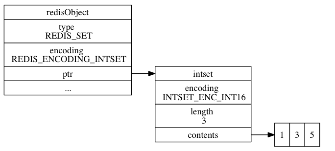
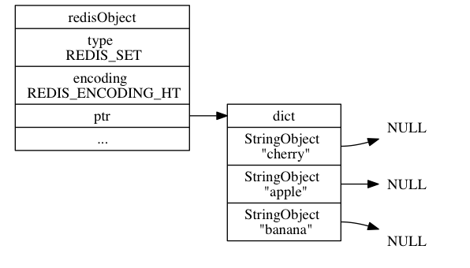

# 集合对象


## 编码

集合对象的编码可以是 `intset` 或者 `hashtable` 。

### inset

```shell
redis> SADD numbers 1 3 5
(integer) 3
```



### hashtable

hashtable 编码的集合对象使用字典作为底层实现， 字典的每个键都是一个字符串对象， 每个字符串对象包含了一个集合元素， 而字典的值则全部被设置为 NULL 

```shell
redis> SADD fruits "apple" "banana" "cherry"
(integer) 3
```



## 编码转换

当集合对象可以同时满足以下两个条件时， 对象使用 `intset` 编码：

1. 集合对象保存的所有元素都是整数值；

2. 集合对象保存的元素数量不超过 `512` 个；

第二个条件的上限值是可以修改的， 具体请看配置文件中关于 `set-max-intset-entries` 选项


```shell
redis> SADD numbers 1 3 5
(integer) 3

redis> OBJECT ENCODING numbers
"intset"


redis> SADD numbers "seven"
(integer) 1

redis> OBJECT ENCODING numbers
"hashtable"
```

