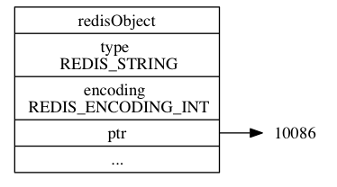

# 字符串对象

## 介绍

字符串对象 string 是 Redis 最简单的数据结构。Redis 所有的数据结构都是以唯一的 key 字符串作为名称，然后通过这个唯一 key 值来获取相应的 value 数据。不同类型的数据结构的差异就在于 value 的结构不一样。

```shell
> set name codehole
OK
> get name
"codehole"
> exists name
(integer) 1
> del name
(integer) 1
> get name
(nil)
```

批量操作

```
> set name1 codehole
OK
> set name2 holycoder
OK
> mget name1 name2 name3 # 返回一个列表
1) "codehole"
2) "holycoder"
3) (nil)
> mset name1 boy name2 girl name3 unknown
> mget name1 name2 name3
1) "boy"
2) "girl"
3) "unknown"
```

**计数**

```shell
> set age 30
OK
> incr age
(integer) 31
> incrby age 5
(integer) 36
> incrby age -5
(integer) 31
> set codehole 9223372036854775807  # Long.Max
OK
> incr codehole
(error) ERR increment or decrement would overflow
```


## 编码

字符串对象的编码可以是 `int` 、 `raw` 或者 `embstr` 。


### int

如果一个字符串对象保存的是整数值， 并且这个整数值可以用 `long` 类型来表示， 那么字符串对象会将整数值保存在字符串对象结构的 `ptr`属性里面（将 `void*` 转换成 `long` ）， 并将字符串对象的编码设置为 `int` 。

```shell
redis> SET number 10086
OK

redis> OBJECT ENCODING number
"int"
```




### SDS

如果字符串对象保存的是一个字符串值， 并且这个字符串值的长度大于 `39` 字节， 那么字符串对象将使用一个简单动态字符串（SDS）来保存这个字符串值， 并将对象的编码设置为 `raw` 。


```shell
redis> SET story "Long, long, long ago there lived a king ..."
OK

redis> STRLEN story
(integer) 43

redis> OBJECT ENCODING story
"raw"
```


###  embstr

如果字符串对象保存的是一个字符串值， 并且这个字符串值的长度小于等于 `39` 字节， 那么字符串对象将使用 `embstr` 编码的方式来保存这个字符串值。


`embstr` 编码是专门用于保存短字符串的一种优化编码方式， 这种编码和 `raw` 编码一样， 都使用 `redisObject` 结构和 `sdshdr` 结构来表示字符串对象， 但 `raw` 编码会调用两次内存分配函数来分别创建 `redisObject` 结构和 `sdshdr` 结构， 而 `embstr` 编码则通过调用一次内存分配函数来分配一块连续的空间， 空间中依次包含 `redisObject` 和 `sdshdr` 两个结构


`embstr` 编码的字符串对象在执行命令时， 产生的效果和 `raw` 编码的字符串对象执行命令时产生的效果是相同的， 但使用 `embstr` 编码的字符串对象来保存短字符串值有以下好处：

1. `embstr` 编码将创建字符串对象所需的内存分配次数从 `raw` 编码的两次降低为一次。
2. 释放 `embstr` 编码的字符串对象只需要调用一次内存释放函数， 而释放 `raw` 编码的字符串对象需要调用两次内存释放函数。
3. 因为 `embstr` 编码的字符串对象的所有数据都保存在一块连续的内存里面， 所以这种编码的字符串对象比起 `raw` 编码的字符串对象能够更好地利用缓存带来的优势。


```
redis> SET msg "hello"
OK

redis> OBJECT ENCODING msg
"embstr"
```


### 补充

最后要说的是， 可以用 `long double` 类型表示的浮点数在 Redis 中也是作为字符串值来保存的： 如果我们要保存一个浮点数到字符串对象里面， 那么程序会先将这个浮点数转换成字符串值， 然后再保存起转换所得的字符串值。

```shell
redis> SET pi 3.14
OK

redis> OBJECT ENCODING pi
"embstr"
```

在有需要的时候， 程序会将保存在字符串对象里面的字符串值转换回浮点数值， 执行某些操作， 然后再将执行操作所得的浮点数值转换回字符串值， 并继续保存在字符串对象里面。


## 编码的转换

`int` 编码的字符串对象和 `embstr` 编码的字符串对象在条件满足的情况下， 会被转换为 `raw` 编码的字符串对象。

对于 `int` 编码的字符串对象来说， 如果我们向对象执行了一些命令， 使得这个对象保存的不再是整数值， 而是一个字符串值， 那么字符串对象的编码将从 `int` 变为 `raw` 。

对于 `embstr` 编码的字符串对象来说，在执行 APPEND 命令之后， 对象的编码可能从 `embstr` 变为 `raw` 
