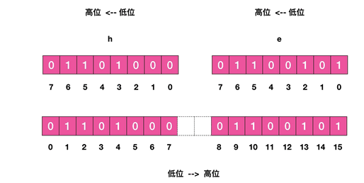

## 使用

### setbit

设置指定位置

```shell
redis>SETBIT bit 0 1  #00000001  这里其实是反的
(integer) 0
redis>SETBIT bit 3 1 #00001001
(integer) 0 
EedIS>SETBIT bit 0 0 #00001000
(integer)1
```



```shell
127.0.0.1:6379> setbit s 1 1
(integer) 0
127.0.0.1:6379> setbit s 2 1
(integer) 0
127.0.0.1:6379> setbit s 4 1
(integer) 0
127.0.0.1:6379> setbit s 9 1
(integer) 0
127.0.0.1:6379> setbit s 10 1
(integer) 0
127.0.0.1:6379> setbit s 13 1
(integer) 0
127.0.0.1:6379> setbit s 15 1
(integer) 0
127.0.0.1:6379> get s
"he"
```


### getbit

获取指定位

```shell
redis>GETBIT   bit 0  #0000100
(integer) 0 
EedIS>GETBIT bit 3  #00001000
(integer)1
```


### bitcount

统计1的个数，可以加范围

```shell
redis>BITCOUNT bit
(integer)1
```


```shell
127.0.0.1:6379> set w hello
OK
127.0.0.1:6379> bitcount w
(integer) 21
127.0.0.1:6379> bitcount w 0 0  # 第一个字符中 1 的位数
(integer) 3
127.0.0.1:6379> bitcount w 0 1  # 前两个字符中 1 的位数
(integer) 7
```


### bitop

对多个位数组进行操作

```shell
127.0.0.1:6379> set w hello
OK
127.0.0.1:6379> bitpos w 0  # 第一个 0 位
(integer) 0
127.0.0.1:6379> bitpos w 1  # 第一个 1 位
(integer) 1
127.0.0.1:6379> bitpos w 1 1 1  # 从第二个字符算起，第一个 1 位
(integer) 9
127.0.0.1:6379> bitpos w 1 2  2 # 从第三个字符算起，第一个 1 位
(integer) 17
```


### bitfield

bitfield 有三个子指令，分别是 get/set/incrby，它们都可以对指定位片段进行读写，但是最多只能处理 64 个连续的位，如果超过 64 位，就得使用多个子指令，bitfield 可以一次执行多个子指令。


```shell
127.0.0.1:6379> set w hello
OK
127.0.0.1:6379> bitfield w get u4 0  # 从第一个位开始取 4 个位，结果是无符号数 (u)
(integer) 6
127.0.0.1:6379> bitfield w get u3 2  # 从第三个位开始取 3 个位，结果是无符号数 (u)
(integer) 5
127.0.0.1:6379> bitfield w get i4 0  # 从第一个位开始取 4 个位，结果是有符号数 (i)
1) (integer) 6
127.0.0.1:6379> bitfield w get i3 2  # 从第三个位开始取 3 个位，结果是有符号数 (i)
1) (integer) -3
```

所谓有符号数是指获取的位数组中第一个位是符号位，剩下的才是值。如果第一位是 1，那就是负数。无符号数表示非负数，没有符号位，获取的位数组全部都是值。有符号数最多可以获取 64 位，无符号数只能获取 63 位 (因为 Redis 协议中的 integer 是有符号数，最大 64 位，不能传递 64 位无符号值)。如果超出位数限制，Redis 就会告诉你参数错误。

```shell
127.0.0.1:6379> bitfield w get u4 0 get u3 2 get i4 0 get i3 2
1) (integer) 6
2) (integer) 5
3) (integer) 6
4) (integer) -3
```

