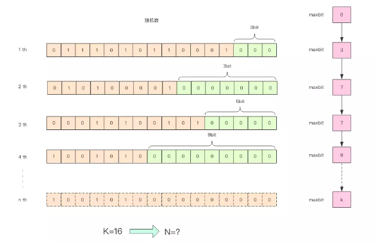

# HyperLogLog


常见应用：

统计网站每个网页每天的 UV 数据，如果统计 PV 那非常好办，给每个网页一个独立的 Redis 计数器就可以了。

但是 UV 不一样，它要去重，同一个用户一天之内的多次访问请求只能计数一次


 HyperLogLog 数据结构就是用来解决这种统计问题的。HyperLogLog 提供不精确的去重计数方案，虽然不精确但是也不是非常不精确，标准误差是 0.81%，这样的精确度已经可以满足上面的 UV 统计需求了


## 使用

HyperLogLog 提供了两个指令 pfadd 和 pfcount，根据字面意义很好理解，一个是增加计数，一个是获取计数。pfadd 用法和 set 集合的 sadd 是一样的，来一个用户 ID，就将用户 ID 塞进去就是。pfcount 和 scard 用法是一样的，直接获取计数值。


### pfadd pfcount

```shell
127.0.0.1:6379> pfadd codehole user1
(integer) 1
127.0.0.1:6379> pfcount codehole
(integer) 1
127.0.0.1:6379> pfadd codehole user2
(integer) 1
127.0.0.1:6379> pfcount codehole
(integer) 2
127.0.0.1:6379> pfadd codehole user3
(integer) 1
127.0.0.1:6379> pfcount codehole
(integer) 3
127.0.0.1:6379> pfadd codehole user4
(integer) 1
127.0.0.1:6379> pfcount codehole
(integer) 4
127.0.0.1:6379> pfadd codehole user5
(integer) 1
127.0.0.1:6379> pfcount codehole
(integer) 5
127.0.0.1:6379> pfadd codehole user6
(integer) 1
127.0.0.1:6379> pfcount codehole
(integer) 6
127.0.0.1:6379> pfadd codehole user7 user8 user9 user10
(integer) 1
127.0.0.1:6379> pfcount codehole
(integer) 10
```


### pfmerge

HyperLogLog 除了上面的 pfadd 和 pfcount 之外，还提供了第三个指令 pfmerge，用于将多个 pf 计数值累加在一起形成一个新的 pf 值。

比如在网站中我们有两个内容差不多的页面，运营说需要这两个页面的数据进行合并。其中页面的 UV 访问量也需要合并，那这个时候 pfmerge 就可以派上用场了。


## 原理



低位连续零位的最大长度 k，通过这个 k 值可以估算出随机数的数量