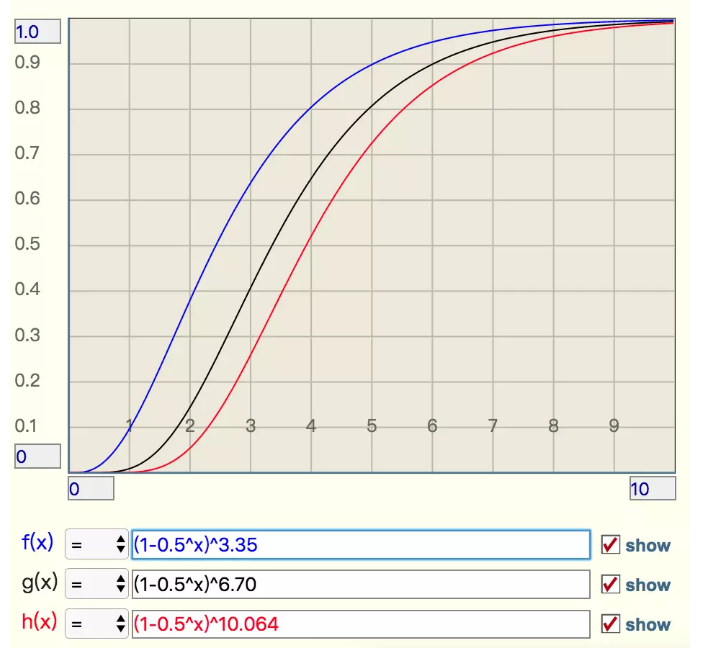
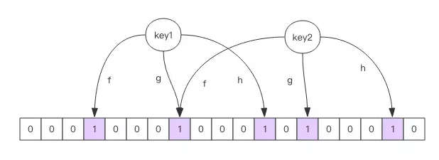

# 布隆过滤器

**布隆过滤器可以理解为一个不怎么精确的 set 结构，是redis的一个插件**，当你使用它的 contains 方法判断某个对象是否存在时，它可能会误判。但是布隆过滤器也不是特别不精确，只要参数设置的合理，它的精确度可以控制的相对足够精确，只会有小小的误判概率。

当布隆过滤器说某个值存在时，这个值可能不存在；当它说不存在时，那就肯定不存在。


布隆过滤器有二个基本指令，`bf.add` 添加元素，`bf.exists` 查询元素是否存在，它的用法和 set 集合的 sadd 和 sismember 差不多。注意 `bf.add` 只能一次添加一个元素，如果想要一次添加多个，就需要用到 `bf.madd` 指令。同样如果需要一次查询多个元素是否存在，就需要用到 `bf.mexists` 指令。

## 使用

```shell
127.0.0.1:6379> bf.add codehole user1
(integer) 1
127.0.0.1:6379> bf.add codehole user2
(integer) 1
127.0.0.1:6379> bf.add codehole user3
(integer) 1
127.0.0.1:6379> bf.exists codehole user1
(integer) 1
127.0.0.1:6379> bf.exists codehole user2
(integer) 1
127.0.0.1:6379> bf.exists codehole user3
(integer) 1
127.0.0.1:6379> bf.exists codehole user4
(integer) 0
127.0.0.1:6379> bf.madd codehole user4 user5 user6
1) (integer) 1
2) (integer) 1
3) (integer) 1
127.0.0.1:6379> bf.mexists codehole user4 user5 user6 user7
1) (integer) 1
2) (integer) 1
3) (integer) 1
4) (integer) 0
```


## 配置

我们上面使用的布隆过滤器只是默认参数的布隆过滤器，它在我们第一次 add 的时候自动创建。Redis 其实还提供了自定义参数的布隆过滤器，需要我们在 add 之前使用`bf.reserve`指令显式创建。如果对应的 key 已经存在，`bf.reserve`会报错。`bf.reserve`有三个参数，分别是 `key`, `error_rate`和`initial_size`。错误率越低，需要的空间越大。`initial_size`参数表示预计放入的元素数量，当实际数量超出这个数值时，误判率会上升。

```shell
redis>bf.reserve hole  0.001   50000
```




从这个图中可以看出曲线还是比较陡峭的

1. 错误率为 10% 时，倍数比为 2 时，错误率就会升至接近 40%，这个就比较危险了
2. 错误率为 1% 时，倍数比为 2 时，错误率升至 15%，也挺可怕的
3. 错误率为 0.1%，倍数比为 2 时，错误率升至 5%，也比较悬了


## 原理



每个布隆过滤器对应到 Redis 的数据结构里面就是一个大型的位数组和几个不一样的无偏 hash 函数。所谓无偏就是能够把元素的 hash 值算得比较均匀。

向布隆过滤器中添加 key 时，会使用多个 hash 函数对 key 进行 hash 算得一个整数索引值然后对位数组长度进行取模运算得到一个位置，每个 hash 函数都会算得一个不同的位置。再把位数组的这几个位置都置为 1 就完成了 add 操作。