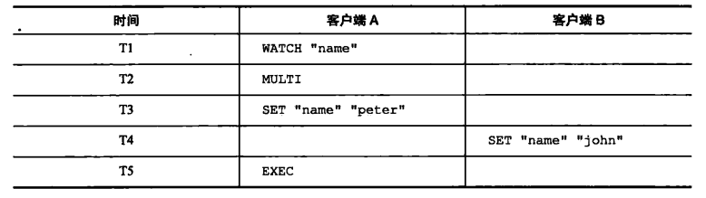
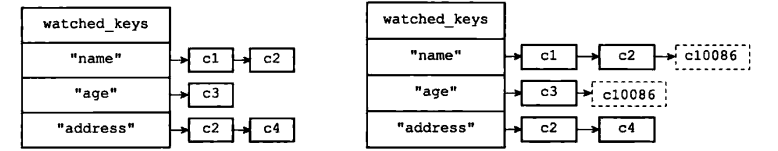

# 事务


## 使用

 multi/exec/discard。multi 指示事务的开始，exec 指示事务的执行，discard 指示事务的丢弃。

```shell
> multi
OK
> incr books
QUEUED
> incr books
QUEUED
> exec
(integer) 1
(integer) 2
```

所有的指令在 exec 之前不执行，而是缓存在服务器的一个事务队列中，服务器一旦收到 exec 指令，才开执行整个事务队列，执行完毕后一次性返回所有指令的运行结果。因为 Redis 的单线程特性，它不用担心自己在执行队列的时候被其它指令打搅，可以保证他们能得到的「原子性」执行。

discard

```shell
> get books
(nil)
> multi
OK
> incr books
QUEUED
> incr books
QUEUED
> discard
OK
> get books
(nil)
```


## 乐观锁WATCH

WATCH命令是一个乐观锁（optimistic locking),它可以在EXEC命令执行之前，监视任意数量的数据库键，并在EXEC命令执行时，检查被监视的键是否至少有一个已经被修改过了，如果是的话，服务器将拒绝执行事务，并向客户端返回代表事务执行失败的空回复。

以下是一个事务执行失败的例子：

```shell
redis>WATCH "name"
ok
redis>MULTI
ok
redis>SET name "petez"
QUEUED
redis>EXEC
(nil)
```




**实现**

每个Redis数据库都保存着一个watched_keys字典，这个字典的键是某个被WATCH命令监视的数据厍键，而字典的值则是一个链表，链表中记录了所有监视相应数据库键的客户端：



所有对数据库进行修改的命令，比如SET、LPUSH、SADD、ZREM、DEL、FLUSHDB等等，在执行之后都会调用mu1ti.c/touchWatchKey函数对watched_keys字典进行检查，查看是否有客户端正在监视刚刚被命令修改过的数据库键，如果有的话，那么touchWatchKey函数会将监视被修改键的客户端的REDIS_DIRTY_CAS标识打开，表示
该客户端的事务安全性已经被破坏。


当服务器接收到一个客户端发来的EXEC命令时，服务器会根据这个客户端是否打开了REDIS_DIRTY_CAS标识来决定是否执客户端向服务器发送EXEC命令行事务.

## 原子性

事务具有原子性指的是，数据库将事务中的多个操作当作一个整体来执行，服务器要么就执行事务中的所有操作，要么就一个操作也不执行。


不是严格的原子性，不支持事务回滚。Redis的作者在事务功能的文档中解释说，不支持事务回滚是因为这种复杂的功能和Redis追求简单高效的设计主旨不相符，并且他认为，Redis事务的执行时错误通常都是编程错误产生的，这种错误通常只会出现在开发环境中，而很少会在实际的生产环境中出现，所以他认为没有必要为Redis开发事务回滚功能。

```shell
> multi
OK
> set books iamastring
QUEUED
> incr books
QUEUED
> set poorman iamdesperate
QUEUED
> exec
1) OK
2) (error) ERR value is not an integer or out of range
3) OK
> get books
"iamastring"
>  get poorman
"iamdesperate
```


## 一致性

事务具有一致性指的是，如果数据库在执行事务之前是一致的，那么在事务执行之后，无论事务是否执行成功，数据库也应该仍然是一致的。

可以保证，错误的命令不会被执行。

## 隔离性

事务的隔离性指的是，即使数据库中有多个事务并发地执行，各个事务之间也不会互相影响，并且在并发状态下执行的事务和串行执行的事务产生的结果完全相同。
因为Redis使用单线程的方式来执行事务（以及事务队列中的命令），并且服务器保证，在执行事务期间不会对事务进行中断，因此，Redis的事务总是以串行的方式运行的，并且事务也总是具有隔离性的。

满足了事务的「隔离性」，隔离性中的串行化——当前执行的事务有着不被其它事务打断的权利


## 持久性

可以保证，在使用了合理的持久化策略的情况下。