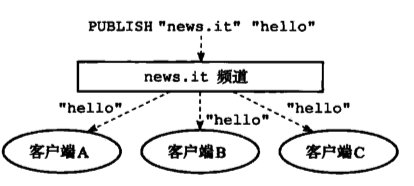
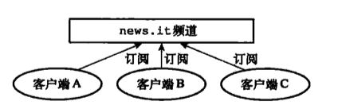
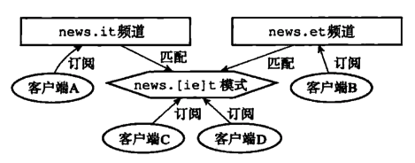
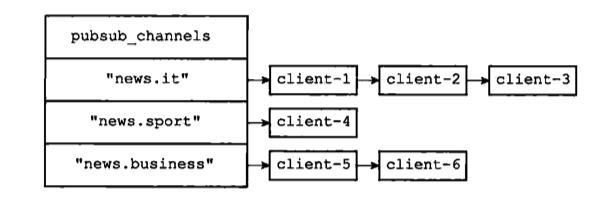
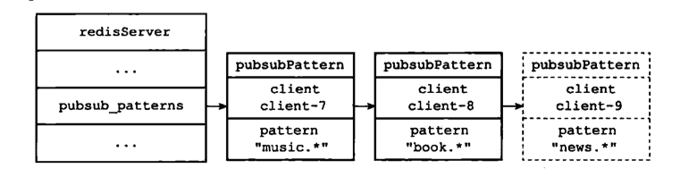

# 发布与订阅


## 介绍

- PUBLISH  向频道推送消息
   


- SUBSCRIBE  订阅频道消息,一个频道或者多个频道

  


- PSUBSCRIBE  **订阅一个或多个模式,一个模式中可以有多个频道**

  成为模式的订阅者：每当有其他客户端向某个频道发送消息时，消息不仅会被发送给这个频道的所有订阅者，它还会被发送给所有与这个频道相匹配的模式的订阅者。




```shell
SUBSCRIBE news.it

PUBLISH news.it  hello
```


## 频道的订阅与退订

### 订阅实现(Dict)

SUBSCRIBE

Redis 将所有频道的订阅关系都保存在服务器状态的 pubsub channels 字典里面，这个字典的键是某个被订阅的频道，而键的值则是一个链表，链表里面记录了所有订阅这个频道的客户端.

```c
Struct redisServer{ 
...
//保存所有频道的订阅关系
dict *pubsub channels;
...
}
```




### 退订实现

UNSUBSCRIBE

- 程序会根据被退订频道的名字，在 pubsub_ channels 字典中找到频道对应的订阅者链表，然后从订阅者链表中删除退订客户端的信息节点

- 如果别除退订客户端之后，频道的订阅者链表变成了空链表，那么说明这个频道已经没有任何订阅者了，程序将从 pubsub channels 字典中删除频道对应的键。


## 模式的订阅 与退订

PSUBSCRIBE

### 订阅实现

服务器也将所有模式的订阅关系都保存在服务器状态的 pubsub_patterns 属性里面


```c
Struct redisServer{ 
...
//保存所有模式的订阅关系
list *pubsub_patterns //链表的节点是pubsubPattern
...
}

Struct pubsubPattern{
  //订阅模式的客户端
  redisClient *client;

  //被订阅的模式
  robi *pattern;
}
```




### 退订实现

PUNSUBSCRIBE 

删除对应节点


## 查看订阅信息

PUBSUB 命令是 Redis2.8 新增加的命令之一，客户端可以通过这个命令来查看频道或者模式的相关信息，比如某个频道目前有多少订阅者，又或者某个模式目前有多少订阅者，诸如此类。


### PUBSUB CHANNELS [pattern]

遍历字典DICT,

```shell
Redis> PUBSUB CHANNELS 
1) "news.it"
2) "news.sport" 
```


### PUBSUB NUMSUB [channels]

返回频道订阅者数量

通过找到dict中对应频道键的链表数量实现

```
Redis> PUBSUB NUMSUB news.it news.sport 
1) "news.it"
2) 3
3) "news.sport"
2) 4
```


### PUBSUB NUMPAT 

PUBSUB NUMPAT 子命令用于返回服务器当前被订阅模式的数量。

这个子命令是通过返回 pubsub patterns 链表的长度来实现的


## 总结

- 服务器状态在 pubsub_channel s 字典保存了所有频道的订阅关系：SUBSCRIBE 命令负责将客户端和被订阅的频道关联到这个字典里面，而 UNSUBSCRIBE 命令则负责解除客户端和被退订频道之间的关联。

- 服务器状态在 pubsub_patterns 链表保存了所有模式的订阅关系：PSUBSCRIBE 命令负责将客户端和被订阅的模式记录到这个链表中，而 PUNUBSCRIBE 命令则负责移除客户端和被退订模式在链表中的记录。

- PUBLISH 命令通过访问 pubsub channels 字典来向频道的所有订阅者发送消息，通过访问 pubsub_ patterns 链表来向所有匹配频道的模式的订阅者发送消息 
- PUBSUB 命令的三个子命令都是通过读取 pubsub_channels 字典和 pubsub_patterns 链表中的信息来实现的。


