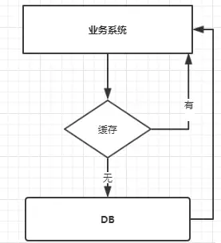

## 缓存概述

 

这里的缓存可能是一层也可能是多层

## 缓存的一些现象

### 缓存穿透

> 穿透的意思是：  缓存拦不住，无效，用板甲抗不了魔法伤害

   比如查询不存在数据，直接打到数据库，量大时候会很危险。甚至有人利用不存在的key频繁攻击应用。

   解决方法:       
   - 缓存空值（不太推荐）   
   
     数据库查询仍然没有后,如果此key多次出现/一次出现,将key->null,设置到缓存，并设置过期时间。
   
-    BloomFilter 布隆过滤器 （推荐）

     注意 布隆过滤器可能将不存在的误判为存在，但已存在的一定不会误判。 
     
     
   可以加到缓存层前面，如果不存在直接返回，如果存在则查缓存->查db   
   
     此处布隆过滤器初始化需要缓存所有可能存在的数据,新加入数据也要加到布隆过滤器。
   
     因为第一种方式可能会缓存大量的不重复的空key,所以第二种方式更常用.

### 缓存击穿 

   高流量并发查询一个key，它突然失效，大量请求打到数据库。

   解决办法：

   - 互斥锁 
   
     缓存查不到时候，先不直接load db，  
     我们可以在第一个查询数据的请求上使用一个互斥锁来锁住它。   
     其他的线程走到这一步拿不到锁就等着，等第一个线程查询到了数据，然后做缓存。后面的线程进来发现已经有缓存了，就直接走缓存。

### 缓存雪崩（很多击穿）

   原因可能是热点key失效时间相同。

   大规模缓存失效，直接把db打挂。

   解决办法: 

   - 事前-集群缓存
   - 事中-
   - 事后-

https://juejin.im/post/5c9442ae5188252d77392241

### 缓存重建

参考 
https://juejin.im/post/5c9a67ac6fb9a070cb24bf34
https://blog.csdn.net/zeb_perfect/article/details/54135506   

  

http://ifeve.com/concurrency-cache-cross/

