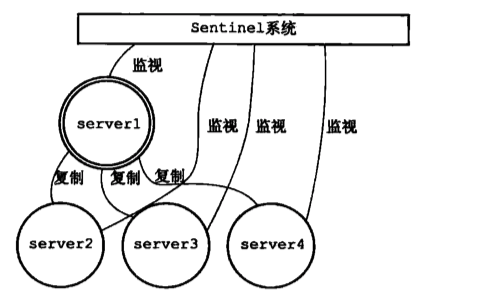
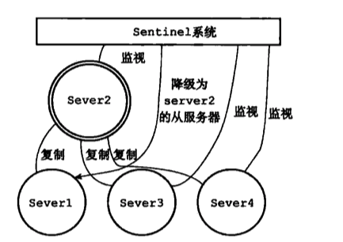
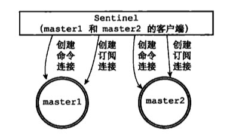
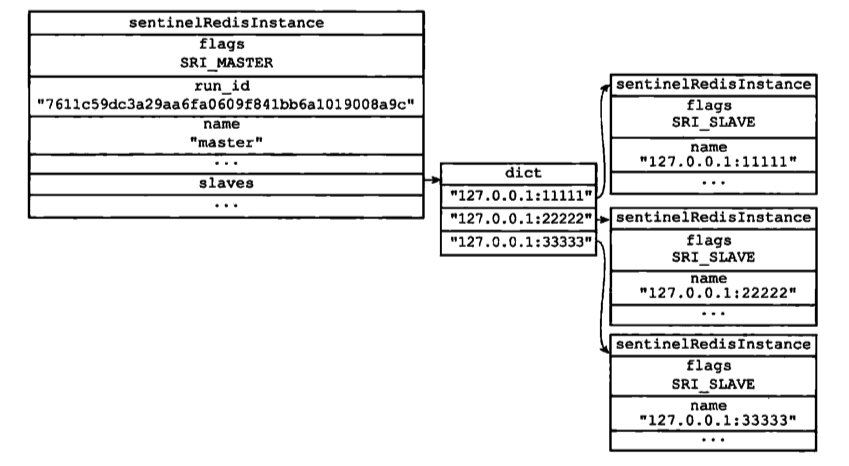

# Sentinel哨兵

英 [ˈsentɪnl] 

> 一种高可用的方案.  哨兵集群,监视多个主服务器以及下属的从服务器.




## 介绍

Server1挂掉,升级Server2为新的主服务器


将原来的主服务器变成从服务器.




## Sentinel启动

当一个 Sentinel 启动时，它需要执行以下步骤：

1) 初始化服务器。

2) 将普通 Redis 服务器使用的代码替换成 Sentinel 专用代码。

3) 初始化 Sentinel 状态。

4) 根据给定的配置文件，初始化 Sentinel 的监视主服务器列表。

5) 创建连向主服务器的网络连接。


### 初始化服务器

首先，因为 Sentinel 本质上只是一个运行在特殊模式下的 Redis 服务器，所以启动 Sentinel  的第一步，就是初始化一个普通的 Redis 服务器.

不过，因为 Sentinel 执行的工作和普通 Redis 服务器执行的工作不同，所以 Sentinel 的初始化过程和普通 Redis 服务器的初始化过程并不完全相同

例如，普通服务器在初始化时会通过载入 RDB 文件或者 AOF 文件来还原数据库状态，但是因为 Sentinel 并不使用数据库，所以初始化 Sentinel 时就不会载入 RDB 文件或者 AOF 文件。


### 使用Sentinel 专用代码

支持的命令都不一样


### 初始化 Sentinel 状态

在应用了 Sentinel 的专用代码之后，接下来，服务器会初始化一个 sentinel. c/ sentinelState 结构（后面简称“Sentinel 状态”），这个结构保存了服务器中所有和 Sentinel 功能有关的状态（服务器的一般状态仍然由 redis.h/ redisServer 结构保存）:

```c
Struct sentinelState{

//当前纪元，用于实现故障转移
uint64_t current_epoch;

//保存了所有被这个 sentinel 监视的主服务器 
//字典的健是主服务器的名字
//字典的值则是一个指向 sentinelRedisInstance 结构的指针 
dict *masters;

//是否进入了titl模式
int titl;

//目前正在执行的脚本的数量
int running_scripts;

//进入titl模式的时何
mistime_t tilt_start_time;

//最后一次执行时间处理器的时间
mistime_t previous_time:

//ー个 FTFO 队列，包含了所有需要执行的用户脚本
list scripts_queue;
}
```


### 初始化 Sentinel 状态的 masters 属性


### 创建连向主服务器的两个连接




- 一个是命令连接，这个连接专门用于向主服务器发送命令，并接收命令回复。
- 另一个是订阅连接，这个连接专门用于订阅主服务器的 sentinel: hello 频道。


## 获取主服务器信息

Sentinel 默认会以每十秒一次的频率，通过命令连接向被监视的主服务器发送 INFO 命令，并通过分析 INFO 命令的回复来获取主服务器的当前信息。

获得回复

```
# Server
run_id:dfasdfjasdjkfljasdflk

# Replication 
role: master

slave0: ip=127.0.0.1, port=11111, state=online, offset-43, lag=0
slave1: ip=127.0.0.1, port=22222, state=online, offset-43, lag=0
slave2: ip=127.0.0.1, port=33333, state=online, offset-43, lag=0
# Other sections
```

然后更新结构




### 获取从服务器信息

**当 Sentinel 发现主服务器有新的从服务器出现时(注意这是从上一步的主服务器INFO命令反馈发现的)，**Sentinel 除了会为这个新的从服务器创建相应的实例结构之外，Sentinel 还会创建连接到从服务器的命令连接和订阅连接。

在创建命令连接之后，Sentinel 在默认情况下，会以每十秒一次的频率通过命令连接向从服务器发送 INFO 命令，并获得类似于以下内容的回复：

```
# Server
run_id:dfasdfjasdjkfljasdflk

# Replication 
role: slave
master_host:127.0.0.1 
master_port: 6379
master_link_status: up

slave_repl_offset: 11887
slave_priority:100
# Other sections
```

根据 INFO 命令的回复，Sentinel 会提取出以下信息：

- 从服务器的运行 ID run id。
- 从服务器的角色 rol e。

- 主服务器的 IP 地址 master host，以及主服务器的端口号 master port 
- 主从服务器的连接状态 master_link_status。
- 从服务器的优先级 slave_ priority
-  从服务器的复制偏移量 slave_repl_offset。


## 搭建

https://www.hi-linux.com/posts/36631.html

## 参考

https://www.cnblogs.com/kevingrace/p/9004460.html

