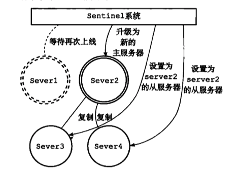

# Sentinel哨兵

> 一种高可用的方案.  哨兵集群,监视多个主服务器以及下属的从服务器.

## Sentinel故障处理

Server1挂掉,升级Server2为新的主服务器

将原来的主服务器变成从服务器.

## Sentinel

首先，因为 Sentinel 本质上只是一个运行在特殊模式下的 Redis 服务器，所以启动 Sentinel  的第一步，就是初始化一个普通的 Redis 服务器.

不过，因为 Sentinel 执行的工作和普通 Redis 服务器执行的工作不同，所以 Sentinel 的初始化过程和普通 Redis 服务器的初始化过程并不完全相同

例如，普通服务器在初始化时会通过载入 RDB 文件或者 AOF 文件来还原数据库状态，但是因为 Sentinel 并不使用数据库，所以初始化 Sentinel 时就不会载入 RDB 文件或者 AOF 文件。

