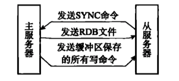
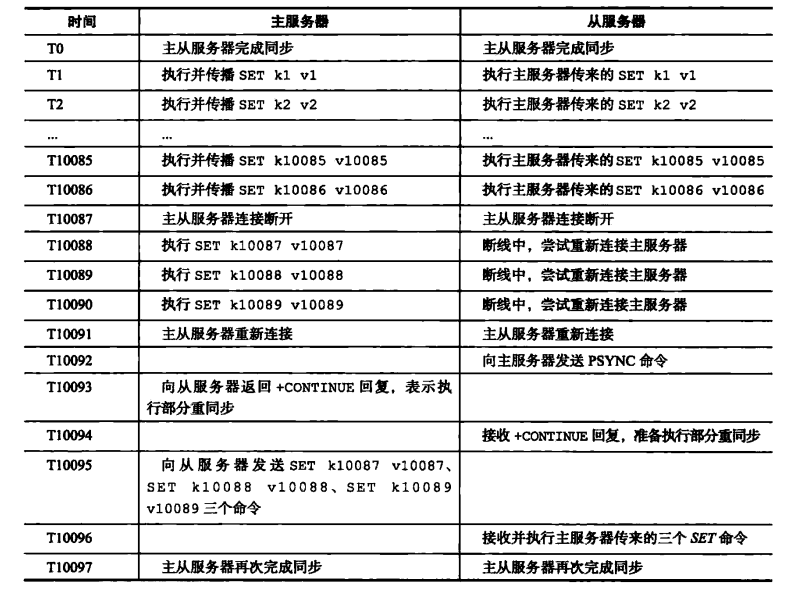
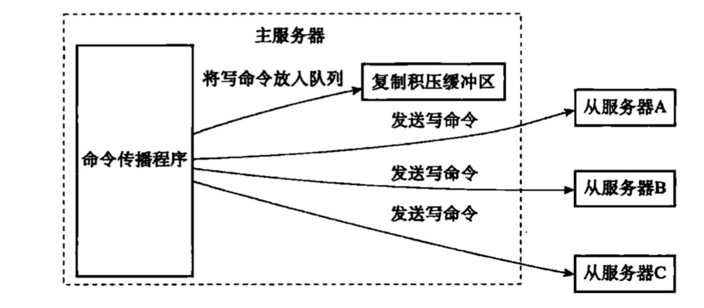
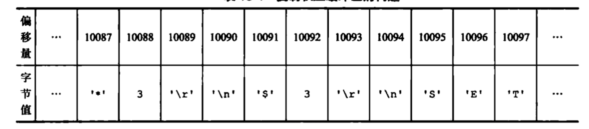
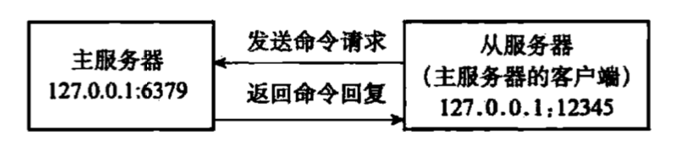
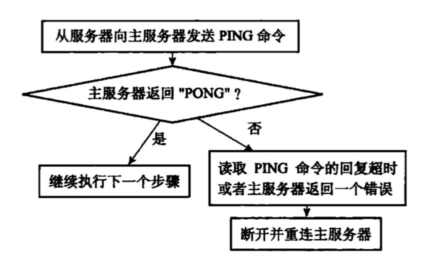
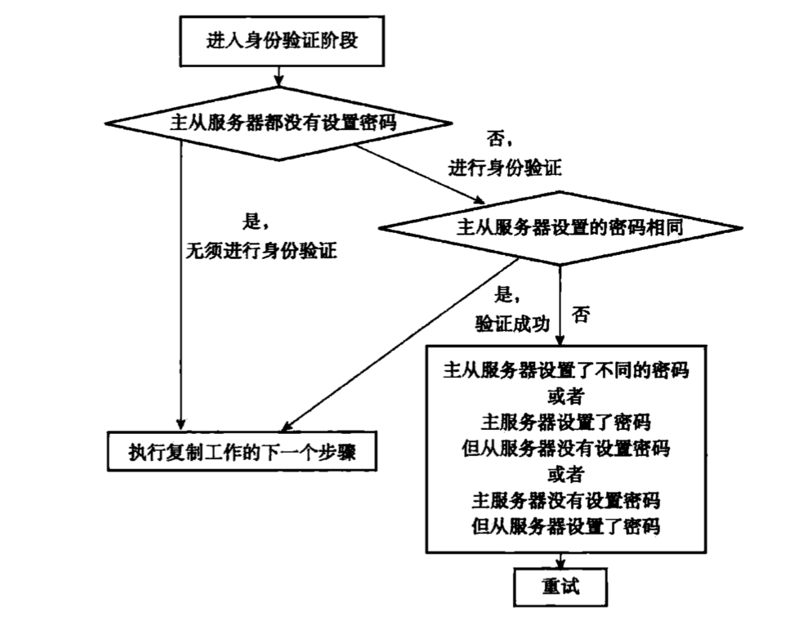
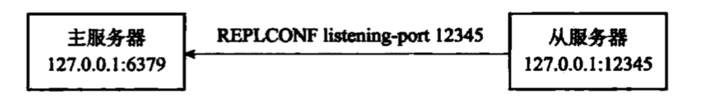

# 主从同步(复制)

## 概述

在 Redis 中，用户可以通过执行 SLAVEOF 命令或者设置 slaveof 选项，让一个服务器去复制(replicate)另一个服务器，我们称呼被复制的服务器为主服务器（master），而对主服务器进行复制的服务器则被称为从服务器（slave）

## 旧版复制功能

旧版制功能分为同步（sync）和命令传播（command propagate）两个操作

- 同步操作用于将从服务器的数据库状态更新至主服务器当前所处的数据库状态。
- 命令传播操作则用于在主服务器的数据库状态被修改，导致主从服务器的数据库状态出现不一致时，让主从服务器的数据库重新回到一致状态。

### sync同步

从服务器向主服务器同步命令`sync`,主服务器接到后执行`bgsave`生成RDB文件,然后发送RDB文件.

在生成RDB文件的过程中,使用一个缓冲区记录从现在开始执行的所有写命令.

在从服务器接受完RDB文件后,主服务器会发送缓冲区中此期间发生的所有的写命令给从服务器.



### 命令传播

在同步操作完成后,主服务器会同步自己所有的写命令给从服务器.

### 旧版复制的缺陷

- 初次复制：从服务器以前没有复制过任何主服务器，或者从服务器当前要复制的主服务器和上一次复制的主服务器不同。

- 断线后重复制：处于命令传播阶段的主从服务器因为网络原因而中断了复制，但从服务器通过自动重连接重新连上了主服务器，并继续复制主服务器。

对于初次复制来说，旧版复制功能能够很好地完成任务，但**对于断线后重复制来说，旧版复制功能会重新走一遍流程,发送RDB文件,十分低效.**

## 新版复制功能

### PSYNC代替SYNC

PSYNC命令具有**完整重同步**（full resynchronization)和**部分重同步**（partial resynchronization)两种模式：

- 完整重同步用于处理初次复制情况，**完整重同步的执行步骤和SYNC命令的执行步骤基本一样**,它们都是通过让主服务器创建并发送RDB文件，以及向从服务器发送保存在缓冲区里面的写命令来进行同步。

 - 部分重同步则用于处理断线后重复制情况：当从服务器在断线后重新连接主服务器时，如果条件允许，主服务器可以将主从服务器连接断开期间执行的写命令发送给从服务器，从服务器只要接收并执行这些写命令，就可以将数据库更新至主服务器当前所处的状态。

     


### 部分重同步的实现

部分重同步功能由以下三个部分构成：

- 主服务器的复制偏移量(replication offset)和从服务器的复制偏移量。
- 主服务器的复制积压缓冲区(replication backlog) 
- 服务器的运行 ID (run ID）。

#### 主服务器的复制偏移量（replication offset)和从服务器的复制偏移量

执行复制的主从服务器都会维护一个偏移量,主服务器发送了N个字节偏移量就加N,从服务器接受了N个字节偏移量也加N.

通过对比主从服务器的复制偏移量，程序可以很容易地知道主从服务器是否处于一致状态 

- 如果主从服务器处于一致状态，那么主从服务器两者的偏移量总是相同的。
- 相反，如果主从服务器两者的偏移量并不相同，那么说明主从服务器并未处于一致状态。

#### 主服务器的复制积压缓冲区

复制积压缓冲区是由主服务器维护的一个固定长度（fixed-size）先进先出（FIFO）队列，默认大小为 1 MB。

当主服务器进行命令传播时,它不仅会将写命令发送给所有从服务器，还会将写命令入队到复制积压缓冲区里面。



主服务器的复制积压缓冲区里面会保存着一部分最近传播的写命令，并且复制积压缓冲区会为队列中的每个字节记录相应的复制偏移量.



当从服务器重新连上主服务器时，从服务器会通过 PSYNC 命令将自己的复制偏移量 offset 发送给主服务器，主服务器会根据这个复制偏移量来决定对从服务器执行何种同步操作.

- 如果offset 偏移量之后的数据（也即是偏移量offset+1 开始的数据）仍然存在于复制积压缓冲区里面，那么主服务器将对从服务器执行部分重同步操作,发送复制积压缓冲区offset后的命令给从服务器。
- 相反，如果 offset 偏移量之后的数据已经不存在于复制积压缓冲区,那么为了数据一致性,只能由主服务器对从服务器执行完整重同步操作。


**如何设置复制积压缓冲区大小**

公式: second * write_size_per_ second 

 second :从服务器断开后重新连接上主服务器所需的平均时间（以秒计算）

 write_size_per_ second 则是主服务器平均每秒产生的写命令数据量（协议格式的写命令的长度总和）。

如果主服务器平均每秒产生 1 MB 的写数据，而从服务器断线之后平均要 5 秒才能重新连接上主服务器，那么复制积压缓冲区的大小就不能低于 5 MB。

#### 服务器的运行ID（Run ID）

**除了复制偏移量和复制积压缓冲区之外，实现部分重同步还需要用到服务器运行ID  (run ID).**

每个 Redis 服务器，不论主服务器还是从服务，都会有自已的运行ID。

运行 ID 在服务器启动时自动生成，由 40 个随机的十六进制字符组成，例如·`53b9b28df8042fdc9 ab5e3fcbbbabff1d5dce2b3 `

当从服务器断线重连,会查看上次同步的主服务器id和当前主服务器id是否一致.

- 如果**从服务器保存的运行 ID 和当前连接的主服务器的运行ID 相同**，那么说明从服

务器断线之前复制的就是当前连接的这个主服务器，主服务器可以继续**尝试执行部分重同步操作**。

- 相反地，如果**从服务器保存的运行 ID 和当前连接的主服务器的运行 ID 并不相同**,那么说明从服务器断线之前复制的主服务器并不是当前连接的这个主服务器，**主服务器将对从服务器执行完整重同步操作**。

### PSYNC命令细节

等待补充.

## 复制的具体过程

通过向从服务器发送` SLAVEOF` 命令，我们可以让一个从服务器去复制一个主服务器

`SLAVEOF  <master ip>  <master port>`

### 步骤 1: 设置主服务器的地址和端口

当客户端向从服务器发送以下命令时：

`127.0.0.1:12345> SLAVEOF 127.0.0 16379`

从服务器首先要做的就是将客户端给定的主服务器 IP 地址 127.0.0.1 以及端口 6379 保存到服务器状态的 `masterhost` 属性和 `masterport` 属性里面.

```c
Struct rediSserver{
// ....  
  
//主服务器的地址
char *masterhost

//主服务器的增口
int masterport;
  
// ....  
}
```

### 步骤 2: 建立套接字连接

在 SLAVEOF 命令执行之后，从服务器将根据命令所设置的 IP 地址和端口，创建连向主服务器的套接字连接.

如果从服务器创建的套接字能成功连接（connect）到主服务器，那么从服务器将为这个套接字关联一个专门用于处理复制工作的文件事件处理器，这个处理器将负责执行后续的复制工作，比如接收 RDB 文件，以及接收主服务器传播来的写命令，诸如此类。


而主服务器在接受（accept）从服务器的套接字连接之后，将为该套接字创建相应的客户端状态，并**将从服务器看作是一个连接到主服务器的客户端来对待**，这时从服务器将同时具有服务器（server）和客户端（client）两个身份：**从服务器可以向主服务器发送命令请求，而主服务器则会向从服务器返回命令回复**.



因为复制工作接下来的几个步骤都会以从服务器向主服务器发送命令请求的形式来进行，所以理解“**从服务器是主服务器的客户端**”这一点非常重要。


### 步骤 3: 发送 PING 命令

从服务器成为主服务器的客户端之后，做的第一件事就是向主服务器发送一个 PING 命令.



- 虽然主从服务器成功建立起了套接字连接，

  但双方并未使用该套接字进行过任何通信，通过发送 PING 命令可以检查套接字的读写状态是否正常。

- 因为复制工作接下来的几个步骤都必须在主服务器可以正常处理命令请求的状态下才能进行，通过发送 PING 命令可以检查主服务器能否正常处理命令请求。


### 步骤 4: 身份验证



### 步骤 5: 发送端口信息

在身份验证步骤之后，从服务器将执行命令` REPLCONF listening-port <port number>`，向主服务器发送从服务器的监听端口号。



主服务器在接收到这个命令之后，会将端口号记录在从服务器所对应的客户端状态的 slave_listening_port 属性中.

```
typedef struct redisClient {

//从服务器的监听墙口号
int slave_listening_port;

} redisClient;
```

### 步骤 6: 同步

在这一步,从服务器将向主服务器发送 PSYNC 命令，执行同步操作，并将自己的数据库更新至主服务器数据库当前所处的状态。

值得一提的是，在同步操作执行之前，只有从服务器是主服务器的客户端，但是在执行同步操作之后，主服务器也会成为从服务器的客户端

- 如果 PSYC 命令执行的是完整重同步操作，那么主服务器需要成为从服务器的客户端，才能将保存在缓冲区里面的写命令发送给从服务器执行。

- 如果 PSYNC 命令执行的是部分重同步操作，那么主服务器需要成为从服务器的客户端，才能向从服务器发送保存在复制积压缓冲区里面的写命令。

因此，**在同步操作执行之后，主从服务器双方都是对方的客户端，它们可以互相向对方发送命令请求，或者互相向对方返回命令回复**.


### 步骤 7: 命令传播

当完成了同步之后，主从服务器就会进入命令传播阶段，这时主服务器只要一直将自己执行的写命令发送给从服务器，而从服务器只要一直接收并执行主服务器发来的写命令，就可以保证主从服务器一直保持一致了。

## 心跳检测

在命令传播阶段，从服务器默认会以每秒一次的频率，向主服务器发送命令

`REPLCONF ACK  <replication offset>`

其中 replication offset 是从服务器当前的复制偏移量。发送 REPLCONFACK 命令对于主从服务器有三个作用

- 检测主从服务器的网络连接状态。

  主服务器会记录slave-ip-port-lag.

  lag是相应的从服务器最后一次向主服务器发送`REPLCONF ACK`命令距离现在过了多少秒

- 辅助实现 min-slaves 选项

  Redis 的 min-slaves-to-write 和 min-slaves-max-lag 两个选项可以防止主服务器在不安全的情况下执行写命令。

  举个例子，如果我们向主服务器提供以下设置

  min-slaves-to-write 3

  min-slaves-max-lag 10

  那么在从服务器的数量少于 3 个，或者三个从服务器的延迟（lag）值都大于或等于 10 秒时，主服务器将拒绝执行写命令，这里的延迟值就是上面提到的 NFO replication 命令的 1ag 值。

- 检测命令丢失(偏移量)。


## 总结

- Redis2.8 以前的复制功能不能高效地处理断线后重复制情况，但 Redis2.8 新添加的部分重同步功能可以解决这个问题。

- 部分重同步通过**复制偏移量、复制积压缓冲区、服务器运行ID** 三个部分来实现。
- 在复制操作刚开始的时候，从服务器会成为主服务器的客户端，并通过向主服务器发送命令请求来执行复制步骤，而在**复制操作的后期，主从服务器会互相成为对方的客户端**。
- **主服务器通过向从服务器传播命令来更新从服务器的状态，保持主从服务器一致，而从服务器则通过向主服务器发送命令来进行心跳检测，以及命令丢失检测**。


