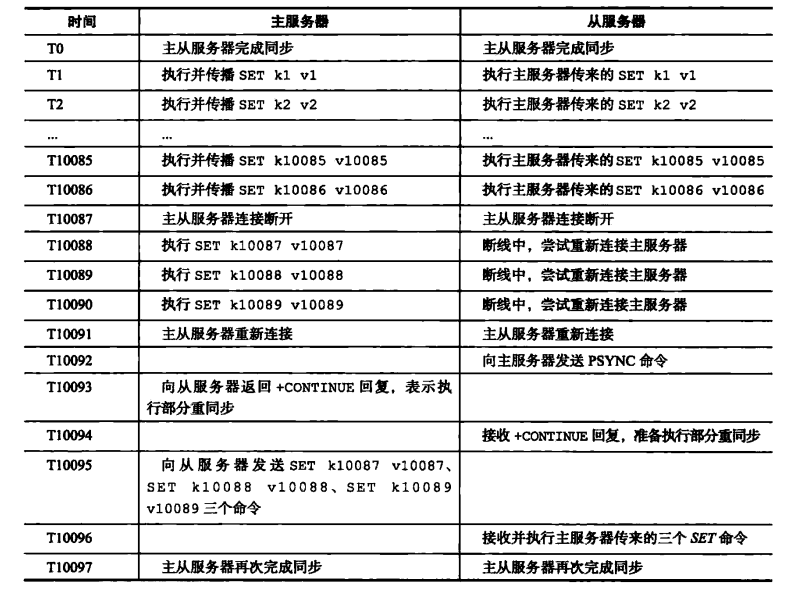

# 主从同步

## PSYNC

PSYNC命令具有完整重同步（full resynchronizanon)和部分重同步（partial resynchronizanon)两种模式：

- 完整重同步用于处理初次复制情况，完整重同步的执行步骤和SYNC命令的执行步骤基本一样,它们都是通过让主服务器创建并发送RDB文件，以及向从服务器发送保存在缓冲区里面的写命令来进行同步。

 - 部分重同步则用于处理断线后重复制情况：当从服务器在断线后重新连接主服务器时，如果条件允许，主服务器可以将主从服务器连接断开期间执行的写命令发送给从服务器，从服务器只要接收并执行这些写命令，就可以将数据库更新至主服务器当前所处的状态。

     

## 部分重同步

### 主服务器的复制偏移量（replication offset)和从服务器的复制偏移量

### 主服务器的复制积压缓冲区

### 服务器的运行ID（Run ID）

